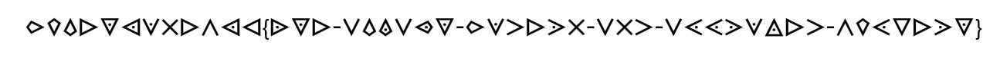
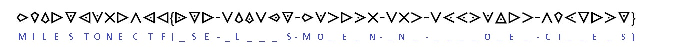

# Message encrypted by Nisse (crypto) (author: stn)

## Description

```
Cyber Nisse started making his jokes. He encrypted the message from Santa to the developers!

Fortunately, he used a really old and obsolete cipher. What is the message?

```

## Task analysis & solution

In the description of this crypto challenge, we've provided with an image:



We can immediately recognize the curly brackets that denote the flag, this is some sort of a cipher.

### Approach A

If you are a brute-force kind of guy like me and you didn't think about actually using google to figure this out, don't worry - there's always a way. Let's try to plot what we already know. Since all cyberxmas flags begin with **MilestoneCTF**, we can deduce a large portion of this one:



So after the initial substitution, we end up with:

```

MILESTONECTF{_ SE-_ L _ _ _ S-MO _ E _ N-_ N _-_ _ _ _ O _ E _-CI _ _ E _ S}

```

Even by just looking at it, one should be able to guess some words, which could potentially help to uncover more and more letters. I could make a wild guess and say the last word is **CIPHERS**, so there we go, three more letters to add to the equation. That would make the string:

```

MILESTONECTF{_ SE-_ L _ _ _ S-MO _ ERN-_ N _-_ PPRO _ E _-CIPHERS}

```

That would probably make the third word **MODERN**, fourth word **AND** and the fifth word **APPROVED**. At this point, if you plot down the symbols against the alphabet, you would notice that they follow a certain pattern and are kind of put together in groups of four. Example:

```

A = \/
B = 
C = /\
D = >

S = triangle with a dot turned south
T = triangle with a dot turned west
U = 
V = triangle with a dot turned north


```

As you can see, B is most likely **<** and U should be **triangle with a dot turned east**. That should make the first word **USE** and we're left with something like:

```

MILESTONECTF{USE-AL _ A _ S-MODERN-AND-APPROVED-CIPHERS}

```

Now if we think about these letters in terms of fours and we also try to guess the last word that looks like **ALWAYS**.. it seems like W X Y Z would be represented by the weird Assassin's Creed symbol with a dot in it.

At this point we can input the flag **MilestoneCTF{use-always-approved-and-modern-ciphers}**

### Approach B

The second approach is the lazy one (:P), but a lot quicker. You could either google something like "cipher triangle with a dot" or take a screenshot of one of the more weird symbols and do an image search. That would quickly lead to the conclusion that this is a **Knights Templar Cipher** and an online decoder like https://www.dcode.fr/templars-cipher (amazing page for decoding all sorts of ciphers for CTFs) could be used to quickly recreate our ciphered text and decode it.

That would once again lead to the flag, which is **MilestoneCTF{use-always-approved-and-modern-ciphers}**