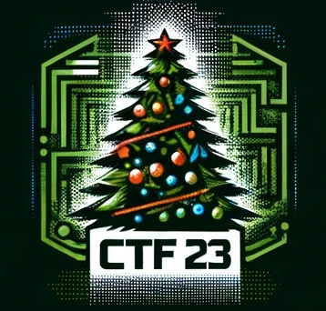
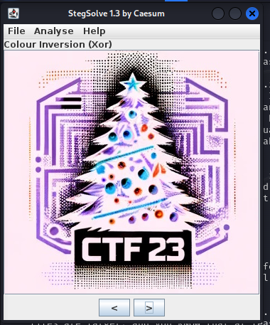

# Did you notice..? (forensics) (author: aldi)

## Tools

steghide or other steganography tools for extracting files hidden within images. All of the tools used here are preinstalled on Kali Linux and could be grabbed for Windows from their respective github pages

## Description

```shell
This flag is lying around for a while, don't pretend you don't know about it.

Note: enter the flag in reverse order MilestoneCTF{abc1234} -> MilestoneCTF{4321cba}
```

## Task analysis & solution

From the challenge description it was obvious that we were already given the flag and we had missed it. Only logical thing that we were supplied with before the challenges started was the “Get ready for the CyberXmas 2023!” announcement email.

That email contained a text poem and a image – we had already used the poem and found the flag there for another challenge – Cyber Xmas Carols. That leaves only the attached email – ctf23.jpg, curious why it was contained within the body of the email, but also attached to it as JPG - something must be hiding in there!



I like image challenges, so I immediately started.

First thought was steganography! I have a very good tool for solving those quick and easy - https://github.com/Giotino/stegsolve, fired it up, loaded the JPG file inside and started experimenting with different options there – it does almost all things needed for steganography challenges:

    -	Colour inversion (xor)
    -	Extracting and showing separate colour/alpha planes
    -	Random colour maps
    -	Full gray/color
    -	Pixel offset
    -	File (exif) information
    -	Etc.

Nevertheless these yielded nothing:



I moved on and decided to check whether the exiftool (https://github.com/exiftool/exiftool) will show something that stegsolve missed:

```shell
└─$ exiftool ctf23.jpg 
ExifTool Version Number         : 12.67
File Name                       : ctf23.jpg
Directory                       : .
File Size                       : 76 kB
File Modification Date/Time     : 2023:12:29 01:56:37-10:00
File Access Date/Time           : 2023:12:29 01:56:37-10:00
File Inode Change Date/Time     : 2023:12:29 01:56:37-10:00
File Permissions                : -rw-------
File Type                       : JPEG
File Type Extension             : jpg
MIME Type                       : image/jpeg
JFIF Version                    : 1.01
Resolution Unit                 : inches
X Resolution                    : 96
Y Resolution                    : 96
Image Width                     : 358
Image Height                    : 342
Encoding Process                : Baseline DCT, Huffman coding
Bits Per Sample                 : 8
Color Components                : 3
Y Cb Cr Sub Sampling            : YCbCr4:4:0 (1 2)
Image Size                      : 358x342
Megapixels                      : 0.122
```

Its not here, okay!
Lastly, I checked through my tools and found steghide (https://github.com/StefanoDeVuono/steghide) which was also a part of the 'official' CyberXmas tools list.
First run of the tool – I didn't get too far... The extraction process required a passphrase.. This really got me thinking...

```shell
└─$ steghide extract -sf ctf23.jpg                                                                                                                          
Enter passphrase: 
steghide: could not extract any data with that passphrase!
```

What could it be… I didn't have to search for long, as I remembered there was something in the CyberXmas announcement email that was sticking out since the first time I read it (last paragraph):

```
} End your quest where secrets tie.
In the spirit of the season, **'hohoho!'** don't deny,
A whisper of mystery, in the festive sky!
```

OK! I ran steghide again, this time providing “hohoho!” as the passphrase:

```shell
└─$ steghide extract -sf ctf23.jpg                                                                                                                          
Enter passphrase: 
wrote extracted data to "flag.txt".
```

A winner! I quickly opened the flag.txt file and grabbed it!
**MilestoneCTF{hiding-in-a-plain-sight-as-usual}**

One last step before we enter it though! We had to reverse the flag as per the requirements of the challenge. I went ahead to CyberChef (https://cyberchef.org/) and used its reverse operation:

**MilestoneCTF{lausu-sa-thgis-nialp-a-ni-gnidih}**
