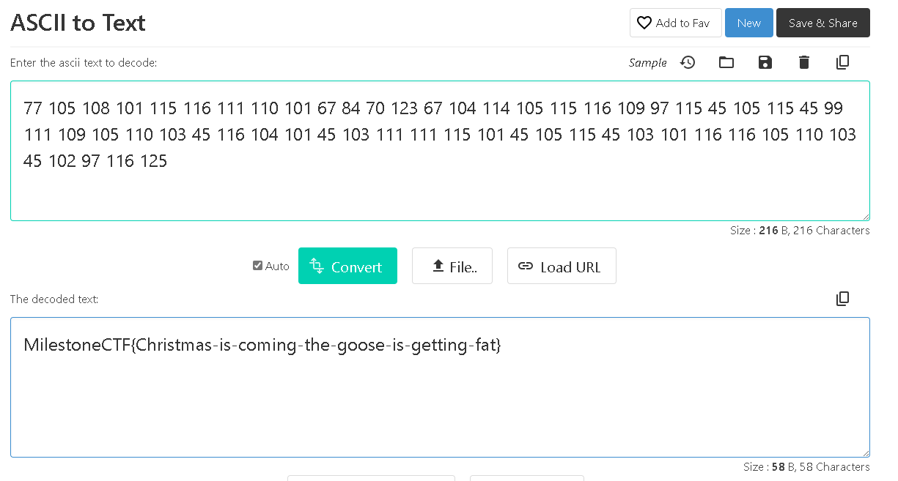

# Cyber language? (misc) (author: stn)

## Tools

**telnet client tool** – command-line tool used for initiating a connection to the target machine, could be installed as a Windows feature (PuTTy is also an option here, or any other tool that can perform the same)

## Description

```shell
Our Cyber Elves have set up a service with a Christmas message. Unfortunately we cannot understand it. Is it cyber-elvish?

Connect to cyberxmas.milestone.dk port 8001

#cyberxmas.milestone.dk tcp port 8001
```

## Task analysis & solution

When we see an address to connect to, immediately we think about telnet (available in Kali Linux, but can also be easily installed on Windows by enabling the feature for telnet client). Let's give this address a go:

```shell

─$ telnet cyberxmas.milestone.dk 8001
Trying 10.10.8.61...
Connected to cyberxmas.milestone.dk.
Escape character is '^]'.
77                                                                                                                         
105
108
101
115
116
111
110
101
67
84
70
123
67
104
114
105
115
116
109
97
115
45
105
115
45
99
111
109
105
110
103
45
116
104
101
45
103
111
111
115
101
45
105
115
45
103
101
116
116
105
110
103
45
102
97
116
125
Connection closed by foreign host.

```

Alright, we got a sequence of numbers.

```
77 105 108 101 115 116 111 110 101 67 84 70 123 67 104 114 105 115 116 109 97 115 45 105 115 45 99 111 109 105 110 103 45 116 104 101 45 103 111 111 115 101 45 105 115 45 103 101 116 116 105 110 103 45 102 97 116 125
```

Now if we sit and observe for a second there, we can see the highest number in the sequence is 125. So this looks an awful lot like ASCII codes. ASCII is a character encoding standard that uses numeric codes to represent text characters. In ASCII, each character is assigned a unique number from 0 to 127, and these numbers are used to represent letters, digits, punctuation marks, and control characters.

Let's try a random online ASCII to text converter, like https://codebeautify.org/ascii-to-text and input the sequence we got from connecting with telnet:



The flag is **MilestoneCTF{Christmas-is-coming-the-goose-is-getting-fat}**