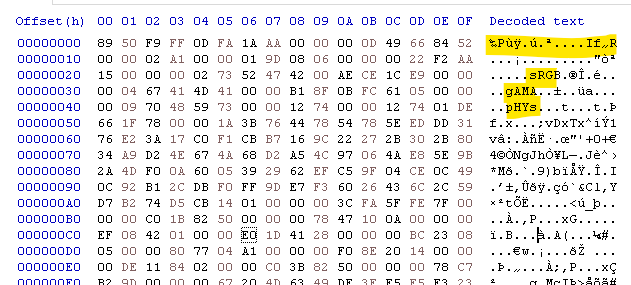
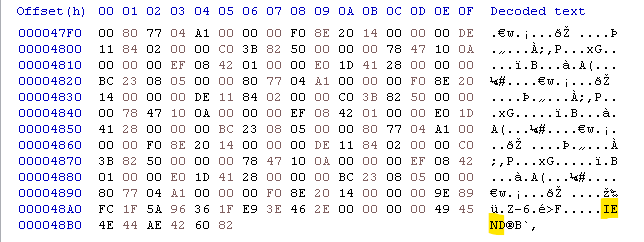
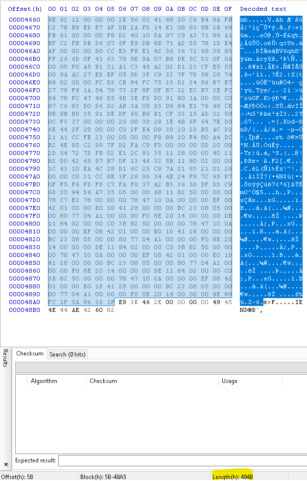
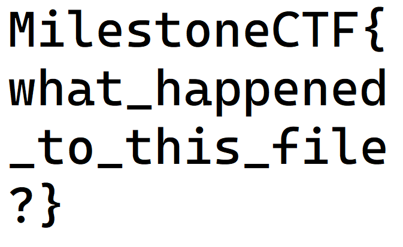

# Mystery box (misc) (author: stn)

## Tools

Any hex editor, I used HxD but there are some with PNG presets that could be even more helpful

pngcheck is very useful here for sanity checks between chunk correction, although there are several online tools that could also help with this

## Description

```
The present is hidden in the box… but how to open it?
```

> [file](./file)

## Task analysis & solution

We are provided with a single file without an extension in the challenge's description. First step would be to figure out what the file is. So let's run the file command in Kali:

```shell
└─$ file file                                                                                                                                               
file: data
```

Most of the time, when we're dealing with a corrupted file, we would get exactly that: **data**. The tool just tells us that this is binary data and the file type cannot be recognized.

Next step would be to fire up a hex editor of your choice. I run HxD here, but there are other useful ones as well.




The beginning of the file looks completely broken, but we do see some strings in there that should tell us what it is: sRGB, gAMA, pHYs and the IEND at the end of the file. 

I used the PNG wiki page for reference: https://en.wikipedia.org/wiki/PNG#File_format and according to that, we're missing some critical chunks of data. Namely IHDR and IDAT. The header of the file is also broken. Let's run a quick pngcheck (a tool for inspecting and validating PNG files)

```shell
└─$ pngcheck -v file                                                                                                                                        
File: file (18614 bytes)
  this is neither a PNG or JNG image nor a MNG stream
ERRORS DETECTED in file

```

The file is not even considered to be a png at this point, so we should probably begin by correcting the header itself. According to the PNG wiki, a PNG file should always start with an 8-byte signature like this:

```shell
89 50 4E 47 0D 0A 1A 0A
```

While ours looks like this:

```shell
89 50 F9 FF 0D FA 1A AA
```

So far so good. I now named the file corrupted.png and ran it through pngcheck once again:

```shell
└─$ pngcheck -v corrupted.png
File: corrupted.png (18614 bytes)
  invalid chunk name "If�R" (49 66 ffffff84 52)
ERRORS DETECTED in corrupted.png
```

I assume the invalid chunk is supposed to be IHDR - Image HeaDeR. I corrected it like this:

```shell
49 66 84 52

#become

49 48 44 52
```

Then I ran pngcheck once again:

```shell
└─$ pngcheck -v corrupted.png                                                                                                                               
File: corrupted.png (18614 bytes)
  chunk IHDR at offset 0x0000c, length 13
    673 x 413 image, 32-bit RGB+alpha, non-interlaced
  chunk sRGB at offset 0x00025, length 2:  invalid length
ERRORS DETECTED in corrupted.png
```

pngcheck is now able to get the resolution out of the IHDR chunk, so we probably have that one right. The next problem is the size of sRGB. It is important to note here, that all chunks in a PNG follow the same structure - Length (4 bytes), Chunk type (4 bytes), Chunk data (Length bytes) and a CRC (4 bytes). The CRC in simple words, is calculated from the data and it is supposed to tell us whether there are modifications or corruptions in the data.

Anyway, from the wiki page we understand that sRGB is always 1 byte long. In our case the length is set to 2. Let's correct that.

```shell
00 00 00 02 73 52 47 42 00 AE CE 1C E9

#become

00 00 00 01 73 52 47 42 00 AE CE 1C E9
```

Then we end up with this output from pngcheck:

```shell
└─$ pngcheck -v corrupted.png                                                                                                                               
File: corrupted.png (18614 bytes)
  chunk IHDR at offset 0x0000c, length 13
    673 x 413 image, 32-bit RGB+alpha, non-interlaced
  chunk sRGB at offset 0x00025, length 1
    rendering intent = perceptual
  chunk gAMA at offset 0x00032, length 4: 0.45455
  chunk pHYs at offset 0x00042, length 9: 4724x4724 pixels/meter (120 dpi)
  chunk vDxT at offset 0x00057, length 6715:  illegal reserved-bit-set chunk
ERRORS DETECTED in corrupted.png
```

Chunk vDxT? That doesn't seem like a valid chunk name at all, but it does look like a broken IDAT chunk (the D and T hint at that). It seems like we have one more correction to do.

```shell
76 44 78 54

#become

49 44 41 54
```

At this point, our PNG started to show signs of improvement and we could see the beginning of the flag:


```shell
└─$ pngcheck -v corrupted.png                                                                                                                               
File: corrupted.png (18614 bytes)
  chunk IHDR at offset 0x0000c, length 13
    673 x 413 image, 32-bit RGB+alpha, non-interlaced
  chunk sRGB at offset 0x00025, length 1
    rendering intent = perceptual
  chunk gAMA at offset 0x00032, length 4: 0.45455
  chunk pHYs at offset 0x00042, length 9: 4724x4724 pixels/meter (120 dpi)
  chunk IDAT at offset 0x00057, length 6715
    zlib: deflated, 32K window, fast compression
  CRC error in chunk IDAT (computed 878fc8f1, expected 2a9c8756)
ERRORS DETECTED in corrupted.png
```

We continue to experience problems with the image, this time with the CRC of the IDAT chunk. I decided to check the length of the IDAT chunk, by selecting the beginning of the data, all the way to the CRC of the IDAT chunk, right before the IEND chunk (length of the selection visible at the bottom):



So I went back to the 4 bytes length of the IDAT chunk and corrected them:

```shell
00 00 1A 3B

#become

00 00 48 4B
```

Voala!



The flag was **MilestoneCTF{what_happened_to_this_file?}**