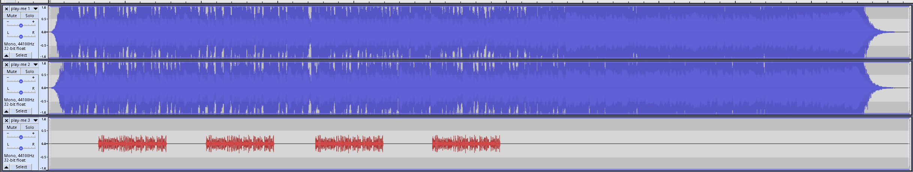
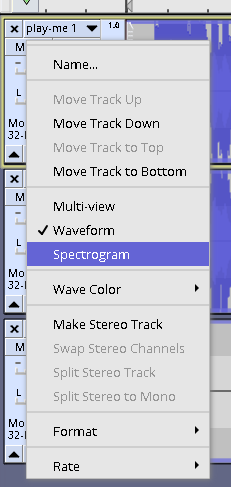
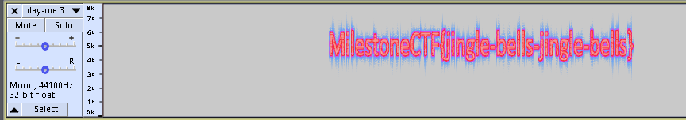

# Time to relax... (misc) (author: stn)

## Tools

Audacity is good to have here or an online alternative - Wavacity https://wavacity.com/

## Description

```
Sit back, play music and enjoy the Xmas spirit ;)

```

> [play-me.wav](./play-me.wav)

## Task analysis & solution

We are presented with a play-me.wav file in the description of the task. I played it in VLC and it seems like a normal Christmas song, so I decided to check the codec / media information from within VLC player. That can be done by going to Tools -> Media Information.

I immediately noticed the random strings that were set for several of the properties:

```

Title: NTQgNjggNjEgNzQgMjcgNzMgMjAgNmUgNmYgNzQgMjAgNjEgMjAgNjYgNmMgNjEgNjcgMjAgNjUgNjkgNzQgNjggNjUgNzIgMmUgMmUgMmU=
Artist: NTQgNjggNjkgNzMgMjAgNjkgNzMgMjAgNmUgNmYgNzQgMjAgNjEgMjAgNjYgNmMgNjEgNjcgMmUgMmUgMmU=
Album: NTcgNjggNzkgMjAgNzcgNmYgNzUgNmMgNjQgMjAgNzkgNmYgNzUgMjAgNzQgNjggNjkgNmUgNmIgMjAgNjkgNzQgMjcgNzMgMjAgNzQgNjggNjEgNzQgMjAgNjUgNjEgNzMgNzkgM2YgMjAgM2EgNDQ=
Genre: NTkgNmYgNzUgMjAgNjEgNzIgNjUgMjAgNzYgNjUgNzIgNzkgMmUgMmUgMmUgMjAgNzAgNjUgNzIgNzMgNjkgNzMgNzQgNjUgNmUgNzQgMjAgM2EgNDQ=
Comments: NDQgNjkgNjQgMjAgNzkgNmYgNzUgMjAgNjcgNmYgMjAgNzQgNjggNzIgNmYgNzUgNjcgNjggMjAgNzQgNjggNjUgNmQgMjAgNjEgNmMgNmMgM2YgMjAgM2EgNDQ=

```

Those are definitely Base64 encoded, but as soon as I put the first one in CyberChef, I got this back:

```

54 68 61 74 27 73 20 6e 6f 74 20 61 20 66 6c 61 67 20 65 69 74 68 65 72 2e 2e 2e

```

These seem like hexadecimal values for ASCII characters, let's convert them to ASCII:

```

That's not a flag either...

```

That's it then, let's get them all:

```

Title: That's not a flag either...
Artist: This is not a flag...
Album: Why would you think it's that easy? :D
Genre: You are very... persistent :D
Comments: Did you go through them all? :D

```

Ok, it seems like those were put there just to throw us off (and throw us off they did :D).

Let's now open the file in Audacity or Wavacity or any other similar program. One of the most intuitive actions to perform would be to check the spectrogram or look for additional tracks within the file. VLC was showing one track, but Wavacity manages to show us three:



Let's show the spectrogram for each of these. You can do that by clicking the dropdown on each track and selecting Spectrogram:



Revealing the spectrogram on the third track also reveals the flag :) 



The flag is **MilestoneCTF{jingle-bells-jingle-bells}**

## Author (stn)