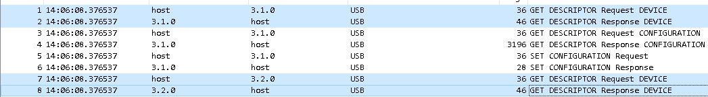

# USB capture (misc) (author: stn)

## Tools

Wireshark is needed to work with the provided capture file.

## Description

```shell
Can you get the flag from this capture?

Note: the flag is case sensitive
```

## Task analysis & solution

The task provides a usb.pcap file. I didn't even know these could exist, but apparently you can capture USB data with Wireshark :) I did a quick investigation and the GET DESCRIPTOR Request/Response packets should contain information about the USB device that is being captured here. In our case there are two pairs of these at the beginning:



The first pair mentions Logitech as the vendor and HD Webcam C525 as the product ID. The second pair - Holtek Semiconductor with an Unknown product 0x0295. Apparently this is some sort of a keyboard. This can be further confirmed by the HID data that is contained within the URB_INTERRUPT packages, judging by the size of it. Keyboard data is supposed to be 8 bytes, the 3rd of which contains the actual keystroke (https://wiki.osdev.org/USB_Human_Interface_Devices#USB_keyboard), while the first byte is a modifier (ie Shift, the wiki page contains table information about those). It makes sense, if we assume that someone was typing in the flag while this capture was taken and thus we need to extract it.

For some reason though, the Wireshark GUI does not allow us to export specific data that we want, but that could be done with **tshark**, which is the command-line equivalent. Since we already know that we need to export the HID data from these packets, we can write a simple display filter. (tshark is in the same installation directory as wireshark).

```
tshark.exe -r usb.pcap -T fields -e usbhid.data -Y "usb.data_len == 8 && usbhid.data" >> keystrokes.txt
```

-r usb.pcap specifies the input file.

-T fields indicates that we want to display specific fields.

-e usbhid.data is the field we want to display / export

-Y "usb.data_len == 8 && usbhid.data" applies a display filter to show only packets where the usb data lenght is 8 bytes and there is actual usbhid data

Now that we have our HID data extracted into a text file, we can either manually go through it and convert it to actual keystrokes, or write a relatively simple script in our language of choice to do that for us. The most cumbersome part of it, would be to create a mapping between the data and the keys, but we can use the mapping HID tables from https://www.usb.org/sites/default/files/documents/hut1_12v2.pdf starting at page 53. Here is a very basic script that will work just fine:

```powershell
$keyMapping = @{
    '0x04'='a';'0x05'='b';'0x06'='c';'0x07'='d';'0x08'='e';'0x09'='f';'0x0A'='g';'0x0B'='h';'0x0C'='i';'0x0D'='j';'0x0E'='k';'0x0F'='l';
	'0x10'='m';'0x11'='n';'0x12'='o';'0x13'='p';'0x14'='q';'0x15'='r';'0x16'='s';'0x17'='t';'0x18'='u';'0x19'='v';'0x1A'='w';'0x1B'='x';
	'0x1C'='y';'0x1D'='z';'0x1E'='1';'0x1F'='2';'0x20'='3';'0x21'='4';'0x22'='5';'0x23'='6';'0x24'='7';'0x25'='8';'0x26'='9';'0x27'='0';
	'0x28'='Enter';'0x29'='Esc';'0x2A'='Backspace';'0x2B'='Tab';'0x2C'='Spacebar';'0x2D'='-';'0x2E'='=';'0x2F'='[';'0x30'=']';'0x31'='\';
	'0x32'='Non-US # and ~';'0x33'=';';'0x34'="'";'0x35'='`';'0x36'=',';'0x37'='.';'0x38'='/';'0x39'='Caps Lock';'0x3A'='F1';'0x3B'='F2';
	'0x3C'='F3';'0x3D'='F4';'0x3E'='F5';'0x3F'='F6';'0x40'='F7';'0x41'='F8';'0x42'='F9';'0x43'='F10';'0x44'='F11';'0x45'='F12';'0x46'='Print Screen';
	'0x47'='Scroll Lock';'0x48'='Pause';'0x49'='Insert';'0x4A'='Home';'0x4B'='Page Up';'0x4C'='Delete';'0x4D'='End';'0x4E'='Page Down';
	'0x4F'='Right Arrow';'0x50'='Left Arrow';'0x51'='Down Arrow';'0x52'='Up Arrow';'0x53'='Num Lock';'0x54'='Keypad /';'0x55'='Keypad *';
	'0x56'='Keypad -';'0x57'='Keypad +';'0x58'='Keypad Enter';'0x59'='Keypad 1';'0x5A'='Keypad 2';'0x5B'='Keypad 3';'0x5C'='Keypad 4';
	'0x5D'='Keypad 5';'0x5E'='Keypad 6';'0x5F'='Keypad 7';'0x60'='Keypad 8';'0x61'='Keypad 9';'0x62'='Keypad 0';'0x63'='Keypad .';
}


$filePath = "keystrokes.txt"
$usbData = Get-Content -Path $filePath

foreach ($line in $usbData) {
    $keystrokeBytes = $line.Substring(4, 2)
    $modifierBytes = $line.Substring(0, 2)
    $keyCode = "0x" + $keystrokeBytes.ToUpper()
    $key = $keyMapping[$keyCode]
    
    if ($key) {
		
		if ($key -eq 'Spacebar') {
			Write-Host ' ' -NoNewLine
			continue
		}
		
		if ($key -eq 'Enter') {
			Write-Host ''
			continue
		}
		
        if ($modifierBytes -eq '02') {
			$key = $key.ToUpper()
		}
		
        Write-Host $key -NoNewLine
    }
}

```

Executing it yields the following output:

```shell
Merry  Cchristmas1  There issoneething you shoulddknow...

MilestoneCTF[we-are-watching-YOUR-keystrokes-6Backspace3;0]

Happy holidays1Backspace1q
```

It goes without saying that the script is incomplete. For example, we need to replace the brackets ([]) with the curly equivalent, whenever there's a shift modifier (0x02 for the first byte). We also have 'Backspace' in the output, which we don't handle. But the output is comprehensive enough for us to modify on the go and figure out the flag: **MilestoneCTF{we-are-watching-YOUR-keystrokes-3:)}**

PS. There is a much more complete python script at https://github.com/carlospolop-forks/ctf-usb-keyboard-parser which could also be used. The README of the github repo also provides pointers into how the keystroke data should be formatted beforehand