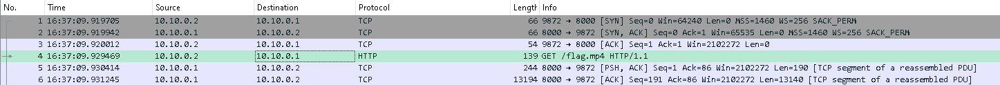

# Network capture (networking) (author: stn)

## Tools

**wireshark** - network protocol analyzer that allows users to inspect, capture, and analyze the traffic flowing on a computer network (absolute must for this challenge)

## Description

```
We got our hands on this network capture, can you figure out what happened?

```

## Task analysis & solution

We're provided with a capture.pcap file in this challenge. The extension suggests we would require the beloved wireshark tool to go through the capture and figure out what is going on.



We can immediatelly see that the 4th packet in the capture is an HTTP GET request originating at source 10.10.0.2 with destination 10.10.0.1 and we're trying to get a flag.mp4. We'll make a wild guess and say that mp4 file is what holds our flag :)

Since wireshark would've caught all that traffic between the client and the server, it is safe to assume that we can 'extract' or recreate the file from that byte data that was captured. Luckily for us, we can do that very easily in wireshark, without the need for extra scripts or any fancy commands. We can go to File -> Export Objects -> HTTP since this is HTTP communication.


In the pane that opens up, we can see our flag.mp4 file, so all we need to do is press Save all (that way we can specify a folder).


Then as we open up the mp4 file with any player (I use VLC as my player of choice), we can see the flag screaming at us:


**MilestoneCTF{extracting-video-from-network-capture}**