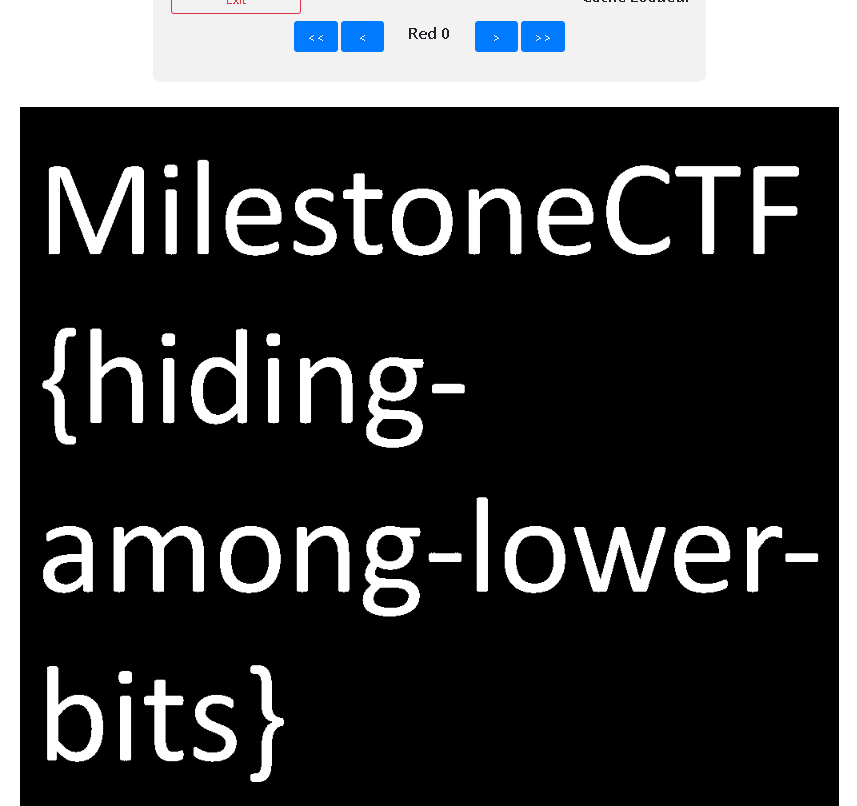

# Not as it looks like (stegano) (author: stn)

## Description

```shell
There is a juicy secret hiden in the image. Can you figure out what it is?
```


## Task analysis & solution

There's always a certain checklist I go through with these challenges, using tools like strings (to get all strings from a file), type (to check the actual file type), Exiftool to check for hiden metadata, binwalk (look for hidden embedded files within a file), some hexeditor / pngcheck to look for corrupted / broken data. None of those tools yielded any results, thus we needed to check the next one on the list, which are the color and bit planes. I know of two separate tools for the job - stegsolve (would require Java to run, as it is distributed as a jar file or you'd need to compile it yourself) or a hefty online alternative - stegonline (https://stegonline.georgeom.net/).

Once we upload the picture there, we can explore a lot of options (i.e. Full Red, Inverse, LSB etc). We can also browse the bit planes by clicking on "Browse Bit Planes". In our case here, we got lucky with the first Red plane: 



Our flag is MilestoneCTF{hiding-among-lower-bits}