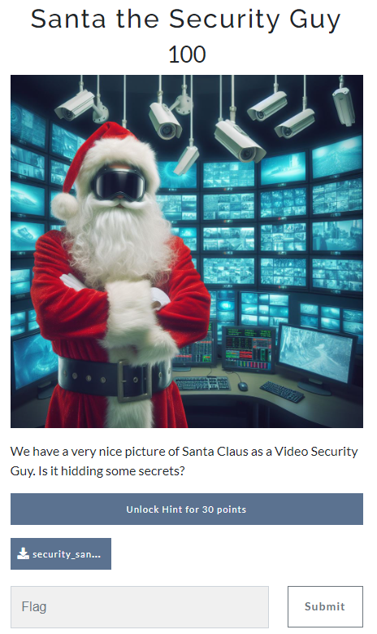
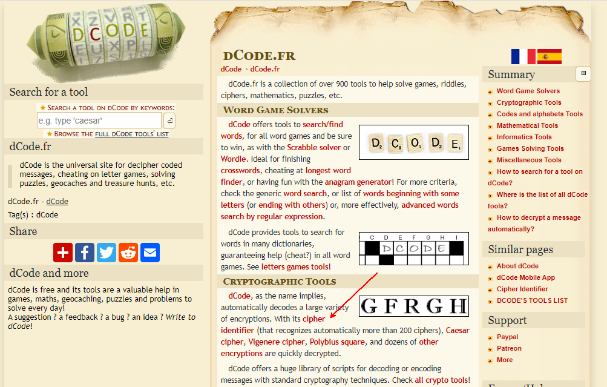
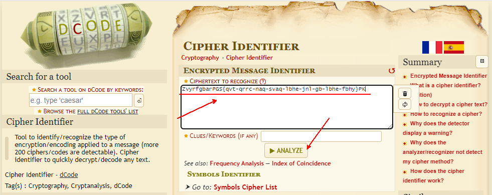
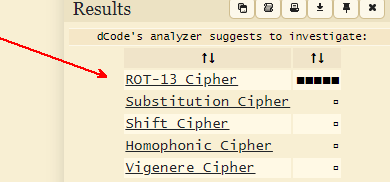
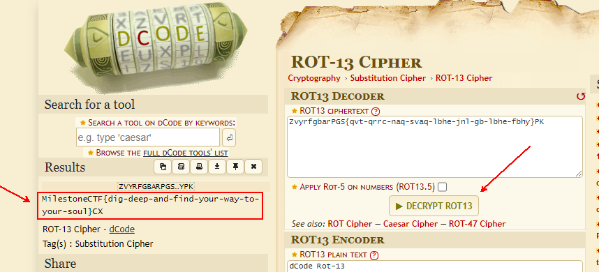

# CTF Milestone 2023 Cyber Xmass

Santa the Security Guy



Write-up

Here in this stegano category challenge we have a file to download - **security_santa_claus.png**

Saved in ~/Desktop/cyber folder

The first thing that came to my mind was to open a console and use the [exif](https://en.wikipedia.org/wiki/Exif) data analyzer tool and see what we have inside. I used `exiftool` from kali distro:

```shell
exiftool security_santa_claus.png
```

Results:
```shell
┌──(snn㉿BGVM-SNN-KALI)-[~/Desktop/cyber]
└─$ exiftool security_santa_claus.png 
ExifTool Version Number         : 12.67
File Name                       : security_santa_claus.png
Directory                       : .
File Size                       : 1166 kB
File Permissions                : -rw-------
File Type                       : PNG
File Type Extension             : png
MIME Type                       : image/png
Image Width                     : 800
Image Height                    : 800
Bit Depth                       : 8
Color Type                      : RGB
Compression                     : Deflate/Inflate
Filter                          : Adaptive
Interlace                       : Noninterlaced
Profile Name                    : scr
Warning                         : Error inflating iCCP
ICC Profile                     : (Binary data 303 bytes, use -b option to extract)
Image Size                      : 800x800
Megapixels                      : 0.640
```

Nothing special. 
So the next tool that I tried was strings - this is a tool that tries to read all strings from specified file

```shell
strings security_santa_claus.png
```

Results:
```shell
0000178471 00000 n 
0000178790 00000 n 
0000179242 00000 n 
0000179651 00000 n 
0000231614 00000 n 
0000232015 00000 n 
0000232497 00000 n 
0000232521 00000 n 
0000246715 00000 n 
0000246949 00000 n 
0000246973 00000 n 
0000264667 00000 n 
0000267936 00000 n 
0000267980 00000 n 
0000268122 00000 n 
trailer
/Size 77
/Root 1 0 R
/Info 57 0 R
/ID[<B5071D44CCF9114EAB68FE1A5B363DA0><2FF8B1931E9D0F4F97B501A0FD567993>]
/Encrypt 75 0 R
startxref
268172
%%EOF
flag.txt
Milestone_EULA_en-US.pdf
ZvyrfgbarPGS{qvt-qrrc-naq-svaq-lbhe-jnl-gb-lbhe-fbhy}PK
IEND
```

I've got interested in the text before IEND tag.

From the previous CTFs we were introduced to [dcode.fr](https://www.dcode.fr) web site:


There is a section where it can try to find the cypher so let's give it a try:



On the left side there are results:



Click on `ROT-13` Cypher and decrypt the message:



:tada:
The flag is **MilestoneCTF{dig-deep-and-find-your-way-to-your-soul}**
