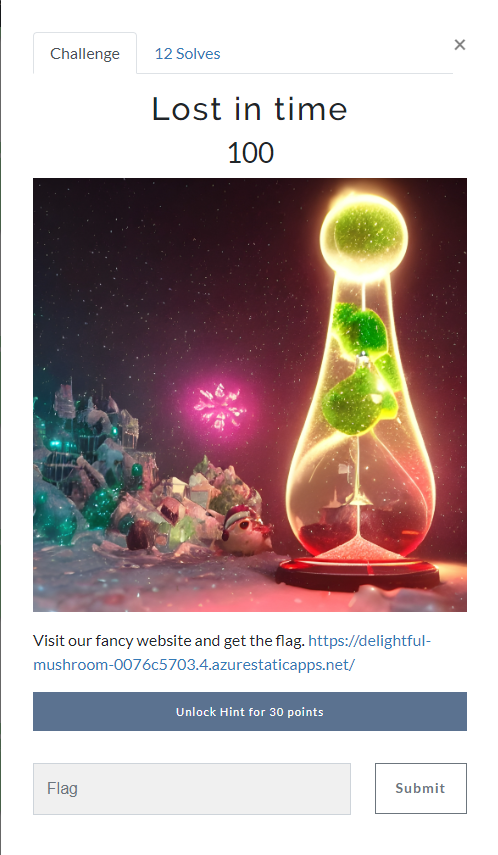

CTF Milestone 2023 Cyber Xmass

Lost In Time



Write-up

The first thing was to open the [link](https://delightful-mushroom-0076c5703.4.azurestaticapps.net)

Next read the poem:

In the world of computer challenges and code,
A story unfolds, of a flag in a digital abode.
Sadly, we must share a not-so-happy tale,
The flag, it seems, has left a virtual trail.

In the dance of cyberspace, in our digital quest,
We tried our best, put the flag to rest.
No trace to follow, no digital sign,
The flag has vanished, by design.

We searched high and low, in the vast digital sea,
To cut ties with the flag, set its data free.
But, alas, no route remains in our quest,
The flag has vanished, a secret at best.

With a heavy heart, we share this news today,
The flag's digital dance led it far away.
As we say goodbye, may your day still gleam,
In the world of cybersecurity, where dreams stream.

At this moment I realized that there is nothing here, 
I did a quick look with *curl*


```shell
curl https://delightful-mushroom-0076c5703.4.azurestaticapps.net
```

Again, no shinanigans here.

After short read of the title again I got the idea to give it a try with one of the tools that was announced in the CTF page -> [Wayback Machine](https://web.archive.org)

If you enter a search for our site we can see that on 4th of December there war 4 entries captured:

```web
Saved 4 times between December 4, 2023 and December 4, 2023.
```


Curl'ed each one to try if there is a flag hidden in:

```shell
curl --silent https://web.archive.org/web/20231204110732/https://delightful-mushroom-0076c5703.4.azurestaticapps.net/ | grep -n --color -C 1 "CTF"```

```

and voala, the flag was in a HTML comment section

28-
29:  <!-- MilestoneCTF{once-on-the-internet-always-on-the-internet} -->
30-
```
