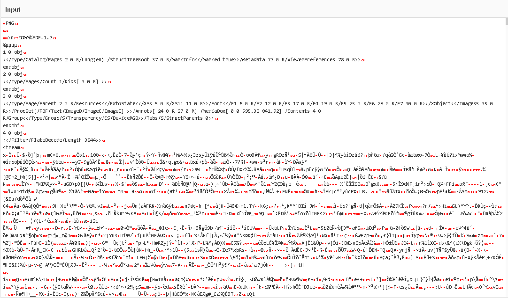
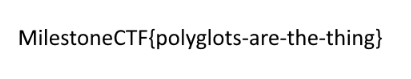

# Come out, come out wherever you are! (forensics) (author: stn)

## Description

```shell
The flag is there, you have it, you just need to find it….
```

## Task analysis & solution

We’re tasked with finding a hidden flag, with the hint that it’s already in our possession. Let’s investigate!

Thinking back to the announcement email for CyberXmas 2024, it included a poster image:


In addition, there was an attachment, [poster.pdf](poster.pdf), which looked identical to the poster image. However, this challenge hints that something might be hiding inside the PDF—a common trick in forensics challenges. To uncover potential hidden data, I loaded the PDF into [CyberChef](https://cyberchef.org/). CyberChef is a versatile tool for inspecting and analyzing files, and it immediately revealed something curious:



The file begins with a PNG header (9PNG...), suggesting that the PDF is actually a polyglot file—a file crafted to behave as multiple formats simultaneously. This means that while the file appears to be a PDF, it also contains an embedded PNG image.

CyberChef conveniently suggested rendering the embedded PNG image with the ``Render Image`` recipe. That revealed the following:



Aaaand the flag was **``MilestoneCTF{polyglots-are-the-thing}``**