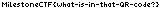

# Do you dare to scan? (forensics) (author: stn)

## Description

```shell
This QR code looks suspicious. Do you dare to scan it?
```

[QR.png](QR.png)

## Task analysis & solution

We’re presented with a picture of a QR code and challenged to scan it to uncover its secrets. Let’s dive right in.


First, scanning the QR code produces the following result:

```
1f8b0808e04558670200746172004acb494c67a031300002737373200d06283458ced890c1d0c4dcc8ccc0c4d0d4dc18286e666664c8a060c04007505a5c9258a4a0c030424167809f3b2f97141790c9ebe9e11204a4170131370713902c6e3e9805a4188b83dc9d18d69d937909e4b0a43bfa3a32306cece7fe93c80ae47316784416333008958030e3bd34f90aa0863c4f17c79008f7b7d36e97353bf0302ffcffff7cc89b9c96c700003701c8febd40fa56c23c38b2ac35249cb459b76d5b1eeece4f7d7db835f531afeb8a10e858e75cc9b4e8148cb428c1eaa013235f744793bc984fc1994f2f2de47b8416b41fd13d15b7450dc7b79981c7ed1ff372362f8a1591b4a0156e55b51fd4c68a005a81e62c446df6edaffdae11ef2cc1fe9491c08c608e46714a8dc8d9dfd2b67994da884cfb51273c528ddb24cafce078cc849ce0806947b4b192113e1bdbb8618e921c41cf4f391c93082a0181761d4d8546c226e0bb0afbaa3663868028930ca336a92ad33e9a118e051981488e93e2ed7fb3435dbc4555c42d1789f73181fdd6e942a975724459b653fbf7fb470b462d75dc0b74cd080745eddf6f3efac444ed07a40f30b593d1f94f307f1cd6aa222d5595d38e4cdce0a428c3138871ca9591c1af4d61b45cbe68375ca45d7be5d26d464c4c7c6b09daaeba353b74fb21ab591fbe97fffed06ff1dfccfe4ec373c37ad6f3c9ff98a63d15ff6d6c71c36ac68bbda008f574f57359e794d0c4300a001b05a36014e007006d6d69a300080000
```

The content looks like a long hexadecimal string. The next step is to decipher this data.

To process the hex string, I used CyberChef, a powerful tool for analyzing and transforming data. Using the "From Hex" recipe, we decode the string into raw byte data.

The result reveals some meaningful clues: CyberChef detects that the data contains a PNG image, archived using TAR and compressed with GZIP. Conveniently, CyberChef suggests a series of recipes to extract the data.

- From Hex – Converts the hex string into raw bytes.

- Gunzip – Decompresses the GZIP archive.

- Untar – Extracts the TAR archive.


After applying these steps, we obtain a PNG image. Viewing the image reveals the following:



And the flag was **``MilestoneCTF{what-is-in-that-QR-code?}``**