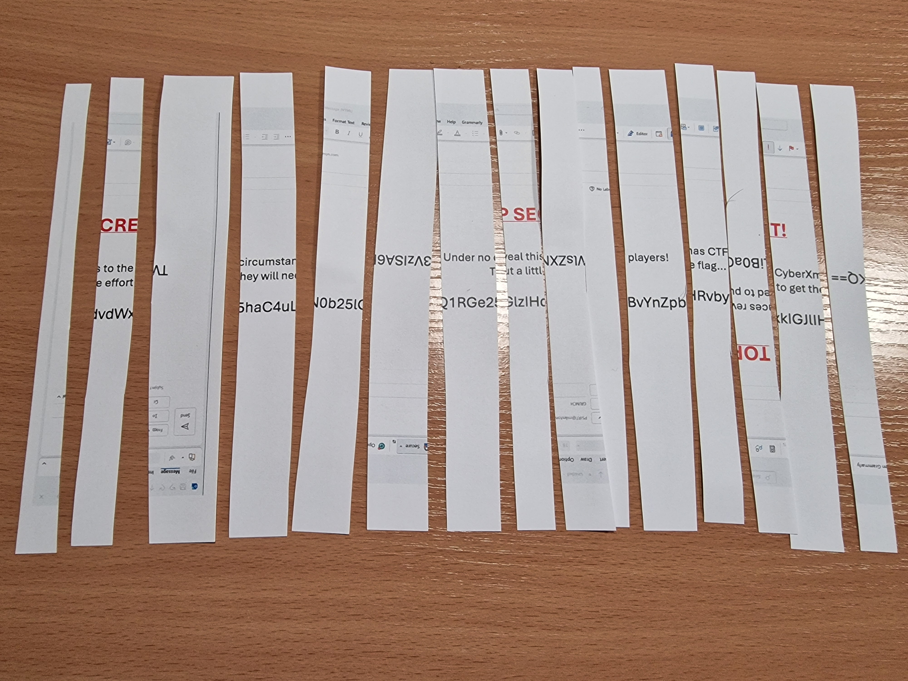
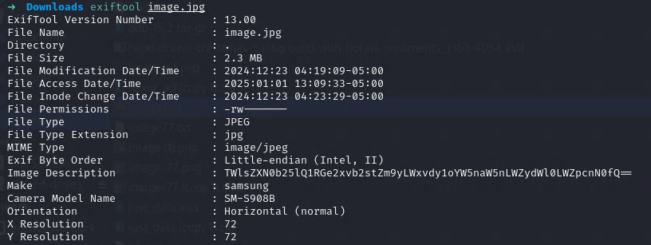
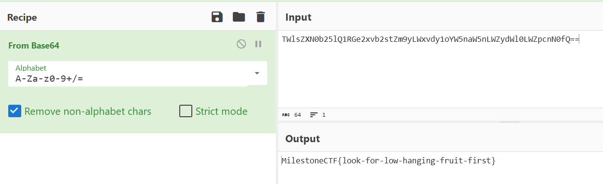

# Mean Grinch

The evil Grinch has captured our TOP SECRET communication and destroyed it. We decided to take an opportunity and make a new challenge of it! :)

Attached you have the picture of what is left out of the message... can you retrieve the flag from it?

We download the attached image, just to see it is a photo of some cut-up document:


At first glance, it seems the cut-up document does contain some base64 code that might be relevant to our exercise, but how do we get that? Cutting up the actual image and moving slices around might be slow and tricky. Let's do some initial investigation in Kali Linux.

Start up [stegsolve](https://github.com/Giotino/stegsolve/releases), load the image, and go through all the different planes to check for hidden info... nothing here as I thought.

Let's check [exiftool](https://exiftool.org/):
```sh
exiftool image.jpg
```



That is most intriguing, a base64 string in the picture metadata. Let's try to convert it from base64. My go-to for that is [CyberChef](https://cyberchef.org/).



Well, that really was a low-hanging fruit :) Submit the flag and it is the correct one!