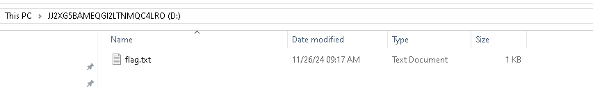
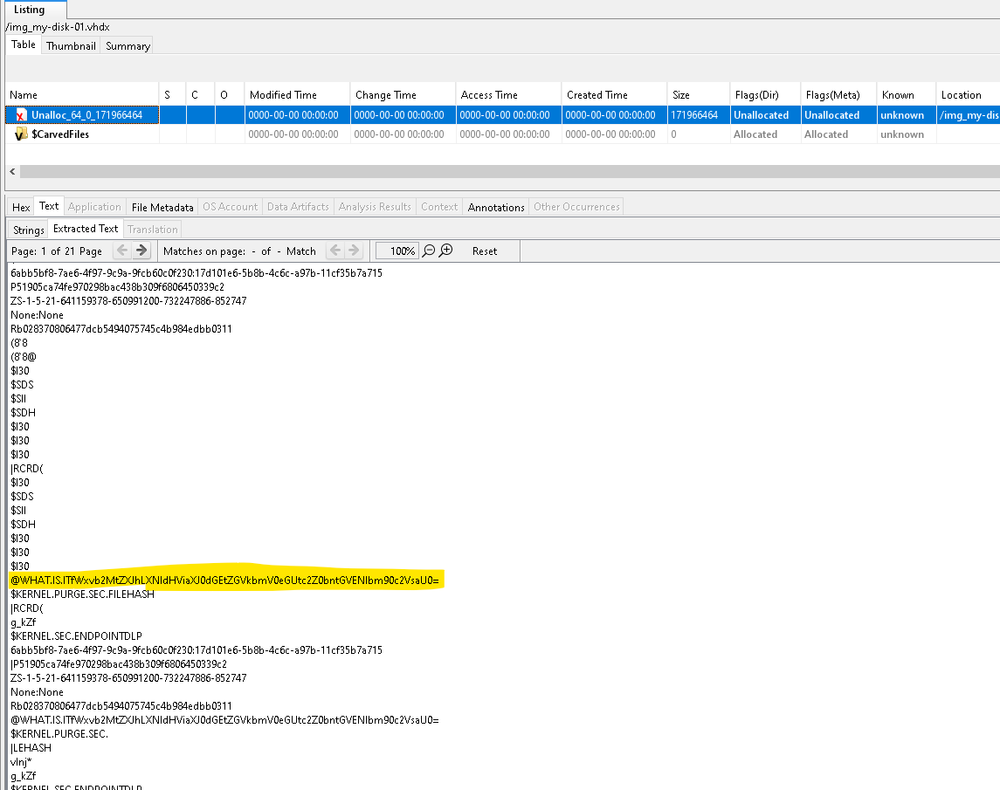

# On the lookout (forensics) (author: stn)

## Description

```shell
Through cyber streams, the elf does tread,

An extended search for the flag ahead.

With Christmas cheer, his heart alight,

He hunts the prize through the digital night.
```

## Task analysis & solution

For this challenge, we've been provided with a .vhdx file. That's a hard disk image file. We can easily mount and inspect it Windows by double clicking the file or right clicking and selecting ``Mount``. Then the disk comes up as any other disk on the filesystem. Now upon mounting this on my own machine and browsing the files, I can immediatelly notice a few things:



There's the name of the disk - it looks like a Base64 or similarly encoded string. Also upon opening the flag.txt, we are met with yet another encoded string.

```
JJ2XG5BAMEQGI2LTNMQC4LRO
```

```
8J+OhOKcqCBFbGZpc2ggUmh5bWUgb2YgdGhlIE1pc3NpbmcgRmxhZyDinKjwn46ECgpPaCBqaW5nbGluZyBieXRlcyBhbmQgY2hpbWluZyBjaGVlciwKVGhlIGZsYWcgeW91IHNlZWsgaXMgbm90IGZvdW5kIGhlcmUhClRoaXMgYm94IG9mIGxpZ2h0IGFuZCB0ZWNoeSBnbG93LApIaWRlcyBubyBzZWNyZXRzIHlvdeKAmWQgd2FudCB0byBrbm93LgoKIkNsb3NlLCBidXQgbm8gZmxhZyEiIGl0IGJvbGRseSBzYWlkLApBcyBjaXJjdWl0cyBzcHVuIGluIGdyZWVuIGFuZCByZWQuClRoZSBlbGYsIHBlcnBsZXhlZCwgc2NyYXRjaGVkIGhpcyBtZXRhbGxpYyBoYXQsCuKAnE1pbGVzdG9uZUNURj8gV2hlcmXigJlzIHRoYXQgYXQ/4oCdCgpQZXJoYXBzIGl04oCZcyBzdGFzaGVkIGluIGEgZGlzdGFudCB0cmVlLApPciBsb2NrZWQgaW4gY29kZSBmb3IgdGhlZSB0byBzZWUuCkEgcHV6emxl4oCZcyBwYXRoLCBhIHRyaWNreSB0cmFpbCwKVG8gY2hhc2UgdGhlIGZsYWcsIHlvdSBtdXN0IHByZXZhaWwhCgpUaGUgY2x1ZXMgYXJlIHNjYXR0ZXJlZCBmYXIgYW5kIHdpZGUsCkluIHJpZGRsZXMsIGNpcGhlcnMsIHBsYWNlcyB0byBoaWRlLgpTbyBvbndhcmQsIHNlZWtlciwgd2l0aCBqb3lmdWwgZ3JpbiwKRm9yIHRoZSBodW504oCZcyB0aGUgZnVuLCBub3QganVzdCB0aGUgd2luIQoK8J+OhfCflI0gSGludDogTG9vayBiZXlvbmQgdGhpcyBnbG93aW5nIHNoZWxmLApGb3IgTWlsZXN0b25lQ1RGe3h4eH0gaGlkZXMgaXRzZWxmIQ==
```

Let's decode them both to see what's hiding inside. The disk name is Base32 encoded and decodes to ``Just a disk...``

And the content of the flag.txt decodes into a poem, which is nice, but unfortunately does not have the flag in it :(

```shell
🎄✨ Elfish Rhyme of the Missing Flag ✨🎄

Oh jingling bytes and chiming cheer,
The flag you seek is not found here!
This box of light and techy glow,
Hides no secrets you’d want to know.

"Close, but no flag!" it boldly said,
As circuits spun in green and red.
The elf, perplexed, scratched his metallic hat,
“MilestoneCTF? Where’s that at?”

Perhaps it’s stashed in a distant tree,
Or locked in code for thee to see.
A puzzle’s path, a tricky trail,
To chase the flag, you must prevail!

The clues are scattered far and wide,
In riddles, ciphers, places to hide.
So onward, seeker, with joyful grin,
For the hunt’s the fun, not just the win!

🎅🔍 Hint: Look beyond this glowing shelf,
For MilestoneCTF{xxx} hides itself!
```

Now there's something more I noticed on the flag.txt's properties window, while the size of the file is just 1000 bytes, the size on disk is much more than that. This might mean that there's something hiding in it, maybe an alternate stream as that is something commonly used in CTF challenges. Let's explore that with a PowerShell script:

```powershell
┏[stn]
┖[D:\]> Get-Item -Path "flag.txt" -Stream *

PSPath        : Microsoft.PowerShell.Core\FileSystem::D:\flag.txt::$DATA
PSParentPath  : Microsoft.PowerShell.Core\FileSystem::D:\
PSChildName   : flag.txt::$DATA
PSDrive       : D
PSProvider    : Microsoft.PowerShell.Core\FileSystem
PSIsContainer : False
FileName      : D:\flag.txt
Stream        : :$DATA
Length        : 1000

PSPath        : Microsoft.PowerShell.Core\FileSystem::D:\flag.txt:what-is-it.png
PSParentPath  : Microsoft.PowerShell.Core\FileSystem::D:\
PSChildName   : flag.txt:what-is-it.png
PSDrive       : D
PSProvider    : Microsoft.PowerShell.Core\FileSystem
PSIsContainer : False
FileName      : D:\flag.txt
Stream        : what-is-it.png
Length        : 2669814
```

There is indeed a hidden PNG file in an alternate stream. Let's extract it. We can do that by copying the contents of the alternate stream to a new file with PowerShell.

```powershell
$binaryData = Get-Content -Path D:\flag.txt:what-is-it.png -AsByteStream -Raw
Set-Content -Path D:\what-is-it.png -Value $binaryData -AsByteStream
```

Unfortunately though, there is no flag in the what-is-it.png file:


It appears I have reached a dead end.. I decided to take a few steps back and go dig into the hard disk file again, which considering the fact that it was mostly empty, had an enourmous file size. I started looking for forensics tools for VHDX files and I found one called Autopsy. The tool looks fairly complex - even setting it up took me a while to figure out. You need to create a case, like a true investigator! Once I managed to load up the disk image file though, I started looking around. You can browse the unallocated space on the disk, present and deleted files, run all sorts of analysis on the disk. When I was browsing the unallocated space, the tool had a tab called "Extracted text" with a bunch of strings. One particular string in there caught my attention:



```
WHAT.IS.ITfWxvb2MtZXJhLXNldHViaXJ0dGEtZGVkbmV0eGUtc2Z0bntGVENlbm90c2VsaU0=
```

Ok, this string contains the name of the PNG file we extracted earlier and is being suffixed by what looks to be another Base64 encoded data. Let's plug it into CyberChef real quick.

```
}looc-era-setubirtta-dednetxe-sftn{FTCenotseliM
```

It appears we have found a reversed flag. Let's fix that: **``MilestoneCTF{ntfs-extended-attributes-are-cool}``**