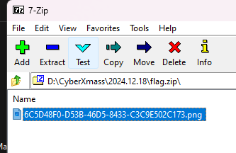
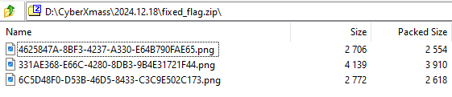
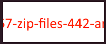
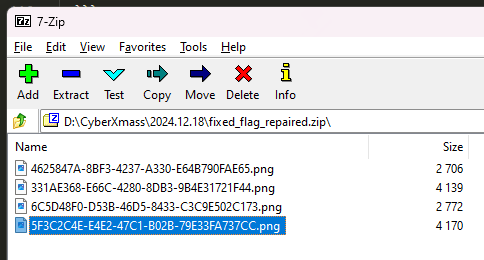

# The Glitch in the Giftwrap (forensics) (author: snn)

## Description

```shell
The flag has been wrapped in the attached archive. Can you extract all of it?
```

## Task analysis & solution

The challenge is in forensics category where we have been provided with a ```flag.zip``` file.

Obviously the first thing to do is to try to open the file and extract the contents.

I have installed 7z and by opening it we can see a single entry there:



That's a image which contains part of the file:


So the rest of the flags should be hidden somewhere.

I tried one of the tools in kali linux distro that scans and shows headers of common file types, here is the result:
```shell
┌──(snn㉿BGLT-SNN-01)-[/mnt/d/CyberXmass/2024.12.18]
└─$ binwalk flag.zip

DECIMAL       HEXADECIMAL     DESCRIPTION
--------------------------------------------------------------------------------
0             0x0             Zip archive data, at least v2.0 to extract, compressed size: 2618, uncompressed size: 2772, name: 6C5D48F0-D53B-46D5-8433-C3C9E502C173.png
2688          0xA80           PNG image, 200 x 80, 8-bit/color RGB, non-interlaced
2815          0xAFF           TIFF image data, little-endian offset of first image directory: 8
3009          0xBC1           Zlib compressed data, compressed
6957          0x1B2D          Zip archive data, at least v2.0 to extract, compressed size: 3910, uncompressed size: 4139, name: 331AE368-E66C-4280-8DB3-9B4E31721F44.png
10937         0x2AB9          Zip archive data, at least v2.0 to extract, compressed size: 2554, uncompressed size: 2706, name: 4625847A-8BF3-4237-A330-E64B790FAE65.png
13705         0x3589          Zip archive data, at least v2.0 to extract, compressed size: 3943, uncompressed size: 4170, name: 5F3C2C4E-E4E2-47C1-B02B-79E33FA737CC.png
17840         0x45B0          End of Zip archive, footer length: 22
```

It looks like the're is some image between the zip headers - starting from 2688 till 6957

there is a command that can copy the bytes by giving the specific offsets - 
[DD command](https://en.wikipedia.org/wiki/Dd_(Unix))

The length can be calculated by substracting the starting headers 

So by using dd command we can extract the image contents into separabte files:
```shell
dd if=flag.zip of=segment1 bs=1 skip=2688 count=$((2815-2688))
dd if=flag.zip of=segment2 bs=1 skip=2815 count=$((3009-2815))
dd if=flag.zip of=segment3 bs=1 skip=3009 count=$((6957-3009))
```

this will create three files with parts of the image
we can combine them to a single png file and render the content:

```shell
cat segment1 segment2 segment3 > combined.png
```

Now we can try to see what is hidden there:

```
First part of the ZIP file (part1): 2688 bytes.
PNG segment (png): 127 bytes.
TIFF segment (tiff): 194 bytes.
Zlib segment (zlib): 3948 bytes.
```
combined.png:


Now, since we've got the hidden file between the zip headers we can try to fix the zip file and get the rest images:

We can use a command to create a zip file by excluding the image contents:

```shell
dd if=flag.zip of=zip_fixed bs=1 count=$((0xA80))
dd if=flag.zip of=remaining_zip bs=1 skip=$((0x1B2D))
```

To combine the zip_fized and remainin_zip we can use cat again:
```shell
cat zip_fixed remaining_zip > fixed_flag.zip
```
Now when we open that fixed_flag.zip file we can see more image files:







Which reveals more from the images, but it looks like we are still missing one.

It looks like the zip is still broken somehow, so I googled a bit how we can fix zip file and I've ended up that there is a zip tool in kali distro that has some fix/repair options.
Let's give it a chance:
```shell
┌──(snn㉿BGLT-SNN-01)-[/mnt/d/CyberXmass/2024.12.18]
└─$ zip
Copyright (c) 1990-2008 Info-ZIP - Type 'zip "-L"' for software license.
Zip 3.0 (July 5th 2008). Usage:
zip [-options] [-b path] [-t mmddyyyy] [-n suffixes] [zipfile list] [-xi list]
  The default action is to add or replace zipfile entries from list, which
  can include the special name - to compress standard input.
  If zipfile and list are omitted, zip compresses stdin to stdout.
  -f   freshen: only changed files  -u   update: only changed or new files
  -d   delete entries in zipfile    -m   move into zipfile (delete OS files)
  -r   recurse into directories     -j   junk (don't record) directory names
  -0   store only                   -l   convert LF to CR LF (-ll CR LF to LF)
  -1   compress faster              -9   compress better
  -q   quiet operation              -v   verbose operation/print version info
  -c   add one-line comments        -z   add zipfile comment
  -@   read names from stdin        -o   make zipfile as old as latest entry
  -x   exclude the following names  -i   include only the following names
  -F   fix zipfile (-FF try harder) -D   do not add directory entries
  -A   adjust self-extracting exe   -J   junk zipfile prefix (unzipsfx)
  -T   test zipfile integrity       -X   eXclude eXtra file attributes
  -y   store symbolic links as the link instead of the referenced file
  -e   encrypt                      -n   don't compress these suffixes
  -h2  show more help
  ```

  So there is a -FF option that we can use:

  ```shell
  ┌──(snn㉿BGLT-SNN-01)-[/mnt/d/CyberXmass/2024.12.18]
└─$ zip -FF fixed_flag.zip --out fixed_flag_repaired.zip
Fix archive (-FF) - salvage what can
 Found end record (EOCDR) - says expect single disk archive
Scanning for entries...
 copying: 6C5D48F0-D53B-46D5-8433-C3C9E502C173.png  (2618 bytes)
 copying: 331AE368-E66C-4280-8DB3-9B4E31721F44.png  (3910 bytes)
 copying: 4625847A-8BF3-4237-A330-E64B790FAE65.png  (2554 bytes)
Central Directory found...
EOCDR found ( 1   9414)...
 copying: 5F3C2C4E-E4E2-47C1-B02B-79E33FA737CC.png  (3943 bytes)
Entry after central directory found ( 1   9436)...
Central Directory found...
EOCDR found ( 1  13571)...
```

This looks promising as the results show one more entry:




Now let's get them all:

    


Flag was **``MilestoneCTF{367-zip-files-442-are-334-very888888-fascinating-and-7777-flexible}``**