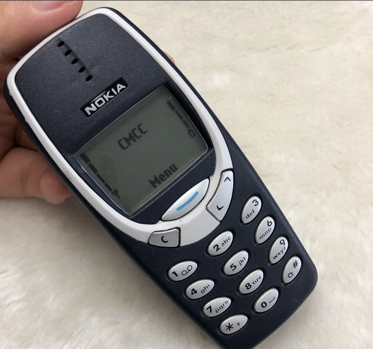

# tap, tap... anyone there? (misc) (author: stn)

## Description

```shell
MjIyIDY2NiA2NiA0IDc3NyAyIDggNzc3NyAwIDggNDQgNDQ0IDc3NzcgMCA0NDQgNzc3NyAwIDggNDQgMzMgMCAzMzMgNTU1IDIgNCAwIDIyMiA2NjYgNjYgOCAzMyA2NiA4
```

## Task analysis & solution

The string in the description looks like it could be encoded, potentially in Base64 or another similar format.

Let's try Base64 first, as one of the most common ones. Decoding it yielded the following output:

```shell
222 666 66 4 777 2 8 7777 0 8 44 444 7777 0 444 7777 0 8 44 33 0 333 555 2 4 0 222 666 66 8 33 66 8
```

In the not-so-distant past, mobile phones used to look like this, remember?



Yes, that’s a Nokia 3310, the legendary phone from a time when texting was an art. Back then, mobile keypads used the T9 text system, where each number mapped to several letters. You'd press the keys repeatedly to cycle through letters. For instance, to type “S” you’d press the ``7`` key four times.

Here’s how it worked:

- 2 → A, B, C
- 3 → D, E, F
- 4 → G, H, I
- 5 → J, K, L
- 6 → M, N, O
- 7 → P, Q, R, S
- 8 → T, U, V
- 9 → W, X, Y, Z
- 0 → Space

Following that scheme, let's try to figure out what the above sequence translates to:

```shell
CONGRATS THIS IS THE FLAG CONTENT
```

And that was it! The flag was a nice trip down memory lane: **``CONGRATS THIS IS THE FLAG CONTENT``**