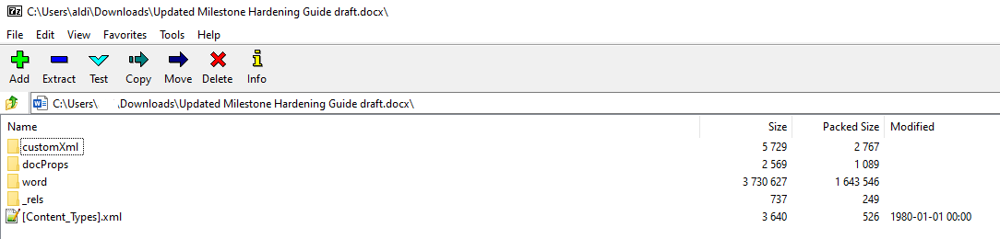
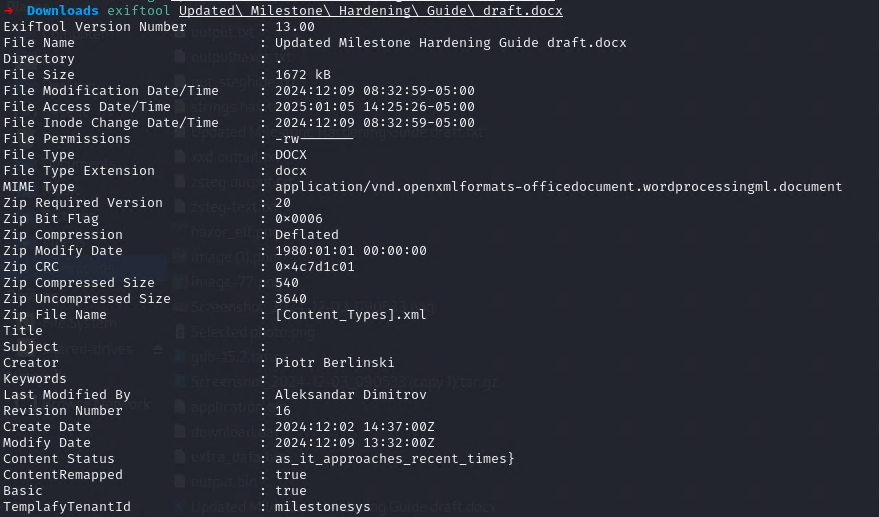
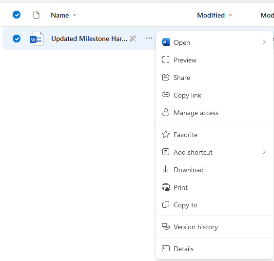
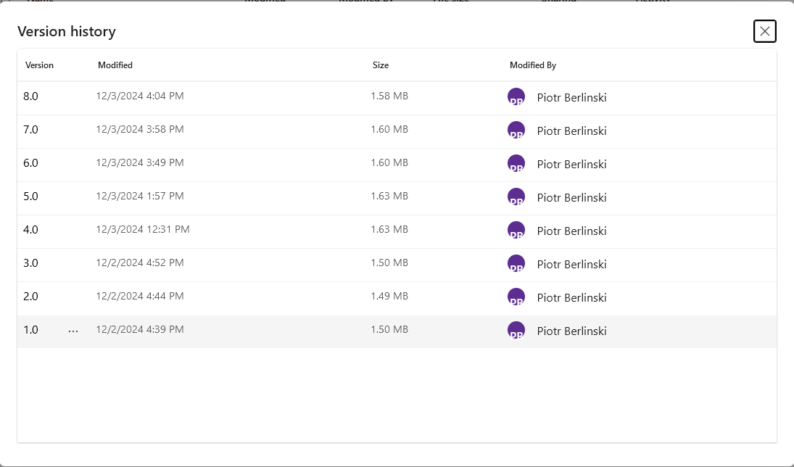
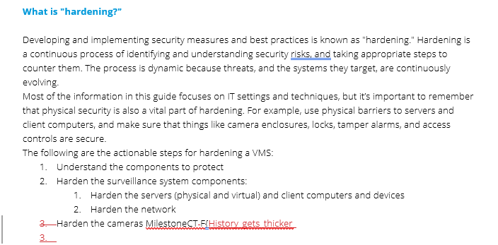

# Securing Santa's VMS

Santa asked the Elves to secure his VMS. They were so smart that they got the latest, unpublished XProtect Hardening Guide! That is a risky situation. There might be something confidential there.
[Link to SharePoint](https://milestonesys365-my.sharepoint.com/:w:/g/personal/pib_milestone_dk/EbYjUcvIa9NNseUHf-aN9U0BGj-DqiyCmir29vABXWggew)

For this challenge, we have a link to the company SharePoint, pointing to the "Updated Milestone Hardening Guide draft" Word document. The document says "updated" so there may be some older version of the file which contains the flag...

Let's download the document and look around. In Kali Linux, we can use `strings` to extract the strings from all sub-files contained in the docx (we know docx is an archive format that contains all relevant data structured in a bunch of sub-files):



But the archive structure doesn't show anything interesting...

```sh
strings Updated\ Milestone\ Hardening\ Guide\ draft.docx
```

String neither...

Ok, document metadata should be checked, using [exiftool](https://exiftool.org/):



Bingo! We have something:
```
Content Status: as_it_approaches_recent_times}
```
That looks like the end of the flag!

Let's take a step back, we might be missing something not related to the downloaded document.

We can go to the SharePoint list containing the document (good thing that way back in the day I have worked with SP).
[SharePoint Link](https://milestonesys365-my.sharepoint.com/personal/pib_milestone_dk/_layouts/15/onedrive.aspx?id=%2Fpersonal%2Fpib_milestone_dk%2FDocuments%2FDocuments%2Fproj%2Fxmas2024&view=0)

It seems we have a context menu here for the document, let's explore that:



Hmm, most of the actions don't seem very interesting, but **Version history**...

Et, voila, we have something:



Not only do we have a bunch of older file versions, but SharePoint lets us just click around and download & read those on the spot! And here we go, one of the files, of course, contains the beginning of the flag!



We can now put the two parts together:
```
MilestoneCTF{History_gets_thicker_as_it_approaches_recent_times}
```
And this is the correct flag! Good job!