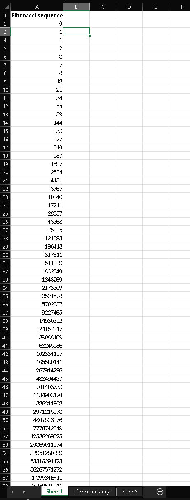

# The Elf's Secret Spreadsheet (office) (author: stn)

## Description

```shell
The little Santa's helpers created some spreadsheet to speed up handling the presents. However they keep some additional secrets there. Can you find it?
```
[just_data.xlsx](just_data.xlsx)

## Task analysis & solution

In this challenge we are provided with an .xlsx file, a spreadsheet. Nothing special at first glance, the file contains three sheets with some values (Fibonacci, life expenctancy, third sheet is empty).



Since every Microsoft Office is essentially an archive with a bunch of files inside, I like to start these challenges by extracting the content and look through the individual files. That's what I did here and furthermore I did a folder wide search with the usual keywords like 'Milestone', 'MilestoneCTF', etc. Then I browsed through the files and I noticed something interesting - in the worksheets folder, there appeared to be four sheets, as opposed to the three that we see when we open the document:


There is also a sharedStrings.xml file (standard file holding all strings) with this content:

```xml
<?xml version="1.0" encoding="UTF-8" standalone="yes"?>
<sst
	xmlns="http://schemas.openxmlformats.org/spreadsheetml/2006/main" count="582" uniqueCount="33">
	<si>
		<t>M</t>
	</si>
	<si>
		<t>i</t>
	</si>
	<si>
		<t>l</t>
	</si>
	<si>
		<t>e</t>
	</si>
	<si>
		<t>s</t>
	</si>
	<si>
		<t>t</t>
	</si>
	<si>
		<t>o</t>
	</si>
	<si>
		<t>n</t>
	</si>
	<si>
		<t>C</t>
	</si>
	<si>
		<t>T</t>
	</si>
	<si>
		<t>F</t>
	</si>
	<si>
		<t>{</t>
	</si>
	<si>
		<t>h</t>
	</si>
	<si>
		<t>d</t>
	</si>
	<si>
		<t>_</t>
	</si>
	<si>
		<t>f</t>
	</si>
	<si>
		<t>r</t>
	</si>
	<si>
		<t>y</t>
	</si>
	<si>
		<t>u</t>
	</si>
	<si>
		<t>}</t>
	</si>
	<si>
		<t>Entity</t>
	</si>
	<si>
		<t>Code</t>
	</si>
	<si>
		<t>Year</t>
	</si>
	<si>
		<t>Period life expectancy at birth - Sex: all - Age: 0</t>
	</si>
	<si>
		<t>Africa</t>
	</si>
	<si>
		<t>Americas</t>
	</si>
	<si>
		<t>Asia</t>
	</si>
	<si>
		<t>Europe</t>
	</si>
	<si>
		<t>Oceania</t>
	</si>
	<si>
		<t>World</t>
	</si>
	<si>
		<t>OWID_WRL</t>
	</si>
	<si>
		<t>Empty</t>
	</si>
	<si>
		<t>Fibonacci sequence</t>
	</si>
</sst>
```

The first few characters in here seem like a malformed flag.. My guess is that these are somehow referenced in the hidden sheet, as they seem to be unique characters - notice how MilestonCTF is misspelt because the 'e' is already present.

At this point, being a programmer myself I started looking for a way to programatically see the content of the document. My quest lead me to ClosedXML (https://github.com/ClosedXML/ClosedXML), a library that helps with manipulating Excel files. It is being distributed as a Nuget package, so it should be easy enough to get started. I came up with this simple code that loads up the file and lists all the worksheets:

```csharp
using ClosedXML.Excel;

class Program
{
    static void Main(string[] args)
    {
        string filePath = "<path-to-xlsx-file>";

        using (var workbook = new XLWorkbook(filePath))
        {
            foreach (var worksheet in workbook.Worksheets)
            {
                Console.WriteLine($"Sheet: {worksheet.Name} (Visibility: {worksheet.Visibility})");
            }
        }
    }
}
```

Then I crossreferenced the output what I see on the sheet:

```
Sheet: Sheet1 (Visibility: Visible)
Sheet: Sheet2 (Visibility: VeryHidden)
Sheet: life-expectancy (Visibility: Visible)
Sheet: Sheet3 (Visibility: Visible)
```

And there we have it, the ``VeryHidden`` *Sheet2*. I will now try to extract the content of it. Let me rework the code a bit:

```csharp
using ClosedXML.Excel;

class Program
{
    static void Main(string[] args)
    {
        string filePath = "<path-to-xlsx-file>";

        using (var workbook = new XLWorkbook(filePath))
        {
            var veryHiddenSheet = workbook.Worksheets.Where(ws => ws.Name.Equals("Sheet2")).FirstOrDefault();

            foreach (var row in veryHiddenSheet.RowsUsed())
            {
                foreach (var cell in row.CellsUsed())
                {
                    Console.Write(cell.Value);
                }
            }
        }
    }
}
```

Running the program revealed the flag in the VeryHidden(TM) sheet: **``MilestoneCTF{hidden_in_front_of_you}``**
