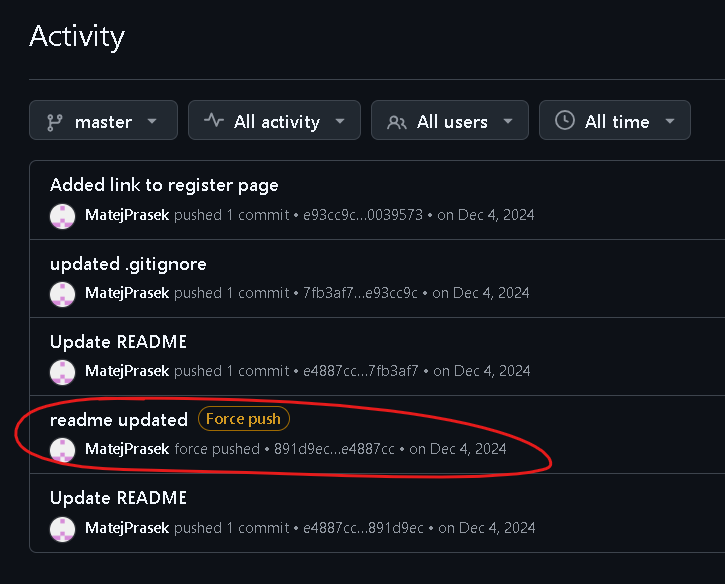
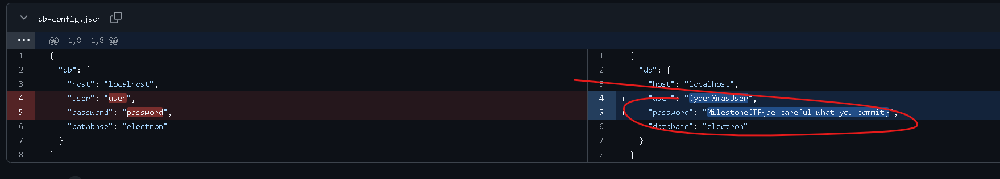

# Github reporsitory (OSINT) (author: stn)

## Description

```shell
We've been informed that some secret is hiding in one of the CyberXmas GitHub repositories. Can you find it?

https://github.com/MatejPrasek/CyberXmas2024
```

## Task analysis & solution

For this challenge, we've been provided with a link to a github repository. It is actually a fork of some other project that is meant to showcase creating a desktop application with Electron, connecting to a MySQL database.

I started by cloning the repo and inspecting the code, looking for any signs of a flag. When I didn't find any, I remembered that this is actually an OSINT (open source intelligence) challenge, which means the flag is probably hidden inside the github repository itself and the code it hosts. Thus, I started looking through the repository - branches, commits, anything that could lead me to a flag. That's when I noticed something interesting. The repo hosts only one branch (master) and its just Matej who has been committing, but looking through the activity on the master branch, there is a force push done on the 4th of Dec:



If we go to the particular commit with hash 891d9ec0500a4a8a9e459a2e4f534c44c52d6033, we will see the original change where the password was set to the flag. It seems like the fork was reset and forced pushed to the original commit e4887cc4a8338573732a410c5d57709300ca87ad.

https://github.com/MatejPrasek/CyberXmas2024/commit/891d9ec0500a4a8a9e459a2e4f534c44c52d6033



The flag was **``MilestoneCTF{be-careful-what-you-commit}``**