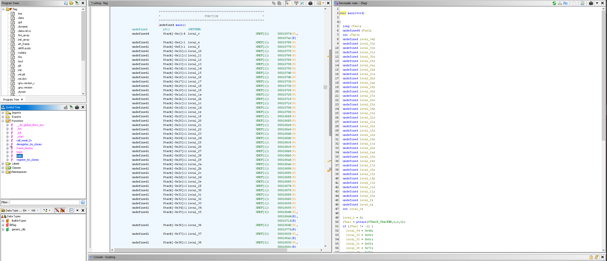

# Reverse engineering for dummies (reverse engineering) (authors: M1dwinter.sln)

## Description

```shell
Rumors say that this file prints out a hash of the flag. Can you recover the original value?
```
[flag](flag)

## Task analysis & solution

Oh boy, was I happy to see such a challenge! I've been waiting a long time to use Ghidra, even though it wasn't even listed as a tool at CyberXmas 2024.

Let's start with the basics, running a binwalk on the file:

```shell
DECIMAL       HEXADECIMAL     DESCRIPTION
--------------------------------------------------------------------------------
0             0x0             ELF, 32-bit LSB executable, ARM, version 1 (SYSV)
```

The file is an ELF executable, no surprise there. This binary format is essentially a container and they can't be executed on Windows, but I had no intentions of running the file anyway. What I did was fire up Ghidra - Ghidra is a reverse engineering tool created by the NSA and nowadays it is even open source. It is a complex, very powerful tool. When you fire it up, create a project and import the file, we are prompted to do an analysis. Then we are met with the codebrowser sub tool, where you can see functions, assembly code and the disassembled C code.




I've selected the main function, which actually refers to a few others. Let's see them here:

```C

bool main(void)

{
  long lVar1;
  undefined4 uVar2;
  int iVar3;
  undefined local_34;
  undefined local_33;
  undefined local_32;
  undefined local_31;
  undefined local_30;
  undefined local_2f;
  undefined local_2e;
  undefined local_2d;
  undefined local_2c;
  undefined local_2b;
  undefined local_2a;
  undefined local_29;
  undefined local_28;
  undefined local_27;
  undefined local_26;
  undefined local_25;
  undefined local_24;
  undefined local_23;
  undefined local_22;
  undefined local_21;
  undefined local_20;
  undefined local_1f;
  undefined local_1e;
  undefined local_1d;
  undefined local_1c;
  undefined local_1b;
  undefined local_1a;
  undefined local_19;
  undefined local_18;
  undefined local_17;
  undefined local_16;
  undefined local_15;
  undefined local_14;
  undefined local_13;
  undefined local_12;
  undefined local_11;
  undefined local_10;
  undefined local_f;
  undefined local_e;
  int local_c;
  
  local_c = 0;
  lVar1 = ptrace(PTRACE_TRACEME,0,0,0);
  if (lVar1 != -1) {
    local_34 = 0x4d;
    local_33 = 0x69;
    local_32 = 0x6c;
    local_31 = 0x65;
    local_30 = 0x73;
    local_2f = 0x74;
    local_2e = 0x6f;
    local_2d = 0x6e;
    local_2c = 0x65;
    local_2b = 0x43;
    local_2a = 0x54;
    local_29 = 0x46;
    local_28 = 0x7b;
    local_27 = 0x65;
    local_26 = 0x61;
    local_25 = 0x73;
    local_24 = 0x79;
    local_23 = 0x2d;
    local_22 = 0x72;
    local_21 = 0x65;
    local_20 = 0x76;
    local_1f = 0x65;
    local_1e = 0x72;
    local_1d = 0x73;
    local_1c = 0x65;
    local_1b = 0x2d;
    local_1a = 0x65;
    local_19 = 0x6e;
    local_18 = 0x67;
    local_17 = 0x69;
    local_16 = 0x6e;
    local_15 = 0x65;
    local_14 = 0x65;
    local_13 = 0x72;
    local_12 = 0x69;
    local_11 = 0x6e;
    local_10 = 0x67;
    local_f = 0x7d;
    local_e = 0;
    uVar2 = hash(&local_34);
    iVar3 = printf("%x\n",uVar2);
  }
  else {
    iVar3 = -1;
  }
  if (local_c != 0) {
                    /* WARNING: Subroutine does not return */
    __stack_chk_fail(iVar3,local_c,0);
  }
  return lVar1 == -1;
}
```

```C
int hash(byte *param_1)

{
  byte *local_14;
  int local_10;
  
  local_10 = 0x1505;
  local_14 = param_1;
  while( true ) {
    if (*local_14 == 0) break;
    local_10 = local_10 * 0x21 + (uint)*local_14;
    local_14 = local_14 + 1;
  }
  return local_10;
}
```

Let's analyze this code a little bit: in the main function we see a bunch of local variables, declared and then initialized with HEX values for characters.

```shell

4d 69 6c 65 73 74 6f 6e 65 43 54 46 7b 65 61 73 79 2d 72 65 76 65 72 73 65 2d 65 6e 67 69 6e 65 65 72 69 6e 67 7d

```

Right before that though, is a call to ``ptrace(PTRACE_TRACEME,0,0,0);`` this is system call which is usually done to prevent the program from being debugged, so in our case, if we attach a debugger in an attempt to extract the flag, it would terminate our program. Then we see that hash() is being called with just ``local_34`` being passed by reference. The result is then printed  with ``printf()``. I can safely assume that whatever is being printed, is not the flag, so let's just convert the hex values from all the variables to ASCII:

```
MilestoneCTF{easy-reverse-engineering}
```

There we go, the flag is **``MilestoneCTF{easy-reverse-engineering}``**