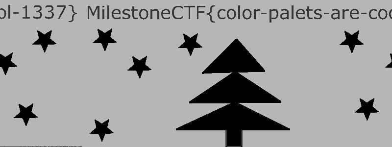

# Fancy postcard (stegano) (author: stn)

## Description

```shell
In the glow of screens this festive night,

Codes unravel by twinkling light.

May your hacks be swift, your exploits grand,

Merry CyberXmas across the land!

Capture the flags with joy and might,

And may your packets all route right.
```
[fancy-postcard.bmp](fancy-postcard.bmp)

## Task analysis & solution

In this challenge we're provided with a bitmap image file of what appears to be a very simple Christmas-themed postcard.


I like to start digging into these with online steganography tools - explore different bitplanes, inverting colors, etc. So I loaded up [CyberChef](https://cyberchef.org/) once again, input the image and applied a grayscale filter to it. To my amazement, I could see the flag right away, even though the image was a bit distorted:



The flag was **``MilestoneCTF{color-palets-are-cool-1337}``**

Usually flag texts give some insight into what the creators' intentions were with the challenge, so I decided to dig a bit into the color palettes of the image.

In a bitmap, the color data is usually placed right after the headers - the bitmap file header and information header. So I loaded up the image in ImHex (a trusted, very good hex editor with nice templates/patterns for widely used file types) and went on a hunt.


The ``rgbq`` is a collection of Colour structs with size 16 - which means there are 16 colors in the picture, consistent with the 4-bit color depth of the image. What is more important here, are the RGB values for the first two colors at indices [0] and [1] - they both have values (0, 2, 80) for RGB which is a dark blue color, coresponding to the background of the image and most likely the hidden text. As far as I'm aware, in bitmap files, the color palettes define available **unique** colors. To test my current theory that one of these is the color of the hidden text overlay, I decided to edit the RGB values of the first colour to something more visible, like bright red with RGB values of (255, 0, 0).

This is what the result looked like:

