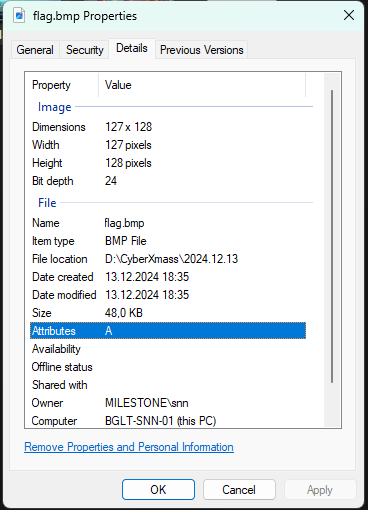
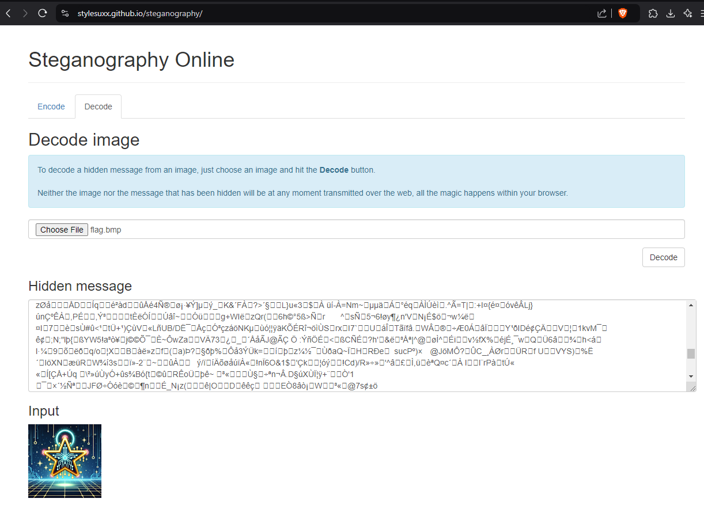

# Twinkle, twinkle (stegano) (author: snn)

## Description

```shell
The thing you are looking for, hides in the stars, but you cannot see it with your bare eyes.
```
[flag.bmp](flag.bmp)

## Task analysis & solution

Another image challenge in **[steganography](https://en.wikipedia.org/wiki/Steganography)** category

So in short - the flag should be hidden somewhere inside the image file - flag.bmp

First try - view properties:


Nothing...

Let's try to see with better tool - `exiftool` from kali distro

```shell
$ exiftool /mnt/d/CyberXmass/2024.12.13/flag.bmp
ExifTool Version Number         : 13.00
File Name                       : flag.bmp
Directory                       : /mnt/d/CyberXmass/2024.12.13
File Size                       : 49 kB
File Modification Date/Time     : 2024:12:13 18:35:20+02:00
File Access Date/Time           : 2025:01:05 22:14:04+02:00
File Inode Change Date/Time     : 2024:12:13 18:35:45+02:00
File Permissions                : -rwxrwxrwx
File Type                       : BMP
File Type Extension             : bmp
MIME Type                       : image/bmp
BMP Version                     : Windows V3
Image Width                     : 127
Image Height                    : 128
Planes                          : 1
Bit Depth                       : 24
Compression                     : None
Image Length                    : 0
Pixels Per Meter X              : 3780
Pixels Per Meter Y              : 3780
Num Colors                      : Use BitDepth
Num Important Colors            : All
Image Size                      : 127x128
Megapixels                      : 0.016
```

Again nothing...

`strings` - a command that primarily focuses on determining the contents of and extracting text from the binary files (non-text file).

```shell
$ strings /mnt/d/CyberXmass/2024.12.13/flag.bmp | grep -i "ctf"
```

No results, nothing that contains ctf in the string...

Next, search online for steganography tools and I ended up to - https://stylesuxx.github.io/steganography/

However it didn't show any meaningful results:



So we need to think a little for this one, we have steganography category with bmp file. Based on that information I searched how can we hide data in bmp files and got to this [tutorial](https://defendtheweb.net/discussion/3743-steganography-how-to-hide-data-inside-image-tutorial)

Based on the above, I searched for steg tools that can help, and I ended up to a [zsteg](https://github.com/zed-0xff/zsteg) tool that can see data in png and bmp files.

Let's give it a try:

```shell
$ zsteg /mnt/d/CyberXmass/2024.12.13/flag.bmp
scanline extradata  ..

    00000000: 00 00 4d 00 00 69 00 00  6c 00 00 65 00 00 73 00  |..M..i..l..e..s.|
    00000010: 00 74 00 00 6f 00 00 6e  00 00 65 00 00 43 00 00  |.t..o..n..e..C..|
    00000020: 54 00 00 46 00 00 7b 00  00 77 00 00 68 00 00 61  |T..F..{..w..h..a|
    00000030: 00 00 74 00 00 5f 00 00  73 00 00 68 00 00 30 00  |..t.._..s..h..0.|
    00000040: 00 6f 00 00 75 00 00 6c  00 00 64 00 00 5f 00 00  |.o..u..l..d.._..|
    00000050: 77 00 00 65 00 00 5f 00  00 64 00 00 30 00 00 5f  |w..e.._..d..0.._|
    00000060: 00 00 77 00 00 69 00 00  74 00 00 68 00 00 5f 00  |..w..i..t..h.._.|
    00000070: 00 34 00 00 6c 00 00 6c  00 00 5f 00 00 74 00 00  |.4..l..l.._..t..|
    00000080: 68 00 00 33 00 00 73 00  00 65 00 00 5f 00 00 73  |h..3..s..e.._..s|
    00000090: 00 00 70 00 00 34 00 00  72 00 00 65 00 00 5f 00  |..p..4..r..e.._.|
    000000a0: 00 62 00 00 79 00 00 74  00 00 65 00 00 73 00 00  |.b..y..t..e..s..|
    000000b0: 7d 00 00 00 00 00 00 00  00 00 00 00 00 00 00 00  |}...............|
    000000c0: 00 00 00 00 00 00 00 00  00 00 00 00 00 00 00 00  |................|
    *
    00000100:
imagedata           .. text: "l+16.5909>2<A6?B7@B7BE8DF8GI7KO2MYo"
b1,lsb,bY           .. file: OpenPGP Public Key
b1,g,msb,xY         .. text: "f-D{\"0.L"
b1,bgr,lsb,xY       .. file: OpenPGP Public Key
b2,r,lsb,xY         .. file: OpenPGP Secret Key
b2,g,lsb,xY         .. text: "\r1UUUUU@"
b2,b,msb,xY         .. text: "8mUUUUUUU"
b4,r,msb,xY         .. file: OpenPGP Secret Key
b4,g,lsb,xY         .. text: "vVgwveajUC!"
b4,b,lsb,xY         .. text: "\"\"\"\"\"\"\"\"\"\"\"\"\"\"2M"
b4,b,msb,xY         .. text: "HDDDDDDDDDDDDDDL"
b4,rgb,msb,xY       .. text: "}_wu[{u_"
```

Nice one: *`MilestoneCTF{what_sh0ould_we_d0_with_4ll_th3se_sp4re_bytes}`*
