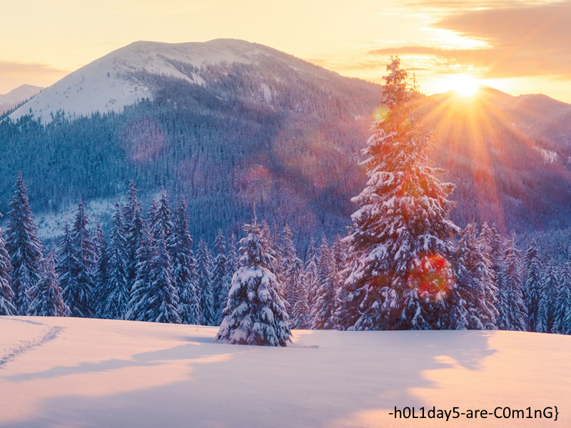
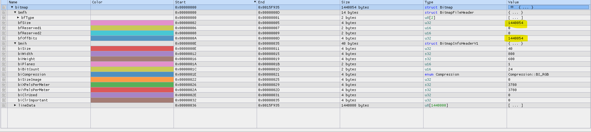
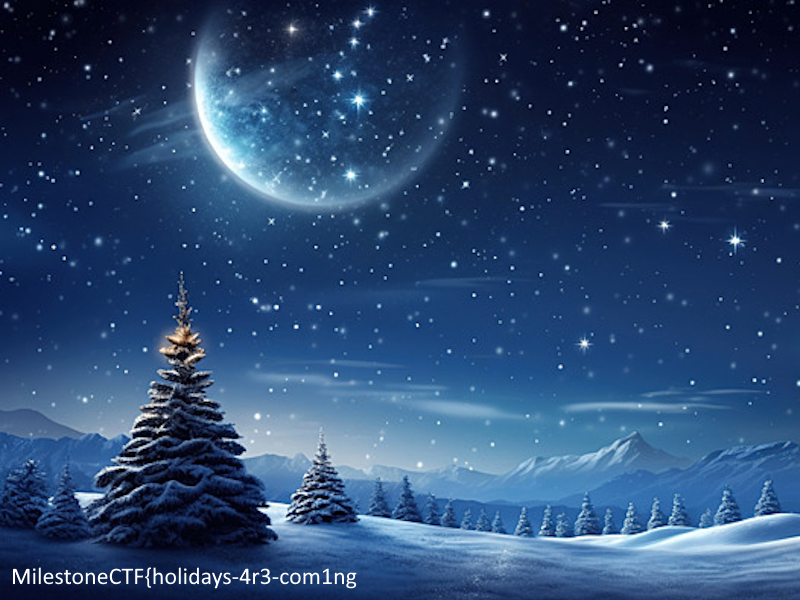

# Wait for it... (stegano) (author: stn)

## Description

```shell
Part of the flag is here for you to grab... The rest, hides in the darkness of the night... !
```
[image-84.bmp](image-84.bmp)

## Task analysis & solution

In this challenge we are provided with the following image:



The description of the challenge suggests that something should probably be done with it to meddle with its contrast or brightness - *the rest hides in the darkness of the night*. 

I plugged the .bmp file in a hex editor (ImHex to be precise) and I noticed something of interest. See, the .bmp files usually start with 2 separate headers - the Bitmap File Header and Bitmap Information Header, both of which contain important information about the image sizes and the offset at which pixel data begins.



We can see on the screenshot:
- the size of the BitmapFileHeader is 14
- the size of the BitmapInformationHeader is 40
- the value of ``bfSize``, which is the size of the whole file, is 1440054
- the ``bfOffBits``, which is the offset at which pixel data begins, is also set to 1440054

But that offset should be the size of both headers, so 54. It turns out that there is another chunk of pixel data past the first one, which the headers don't know about, which enabled the challenge creators to show us a completely different image. 

Let's modify the bfOffBits to 54, save the file and see what happens. Here's the result:



I guess the night is indeed darkest just before the dawn. The flag was **``MilestoneCTF{holidays-4r3-com1ng-h0L1day5-are-C0m1nG}``**

It is important to note that any tool would actually reveal the first image. I did a quick check of CyberChef and it was correctly showing it by just using any image recipe - I suppose the tools understand the discrepancy and fix it, thus revealing the flag.